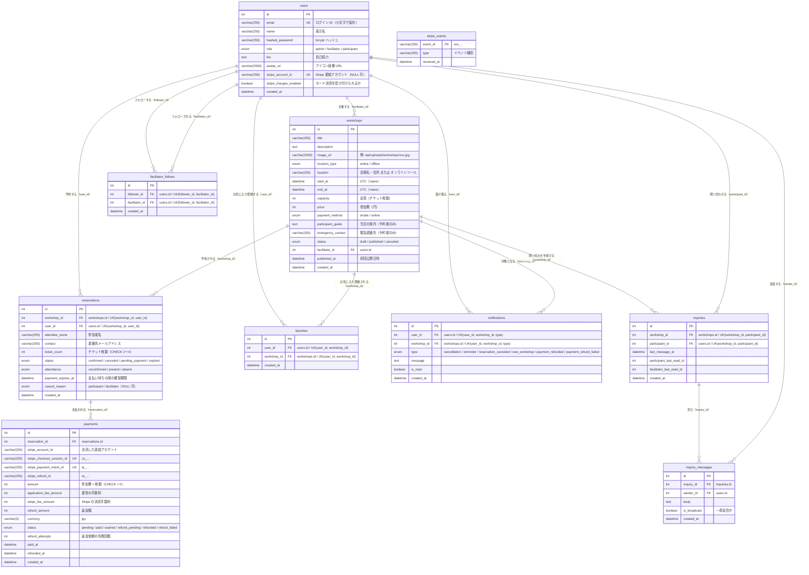
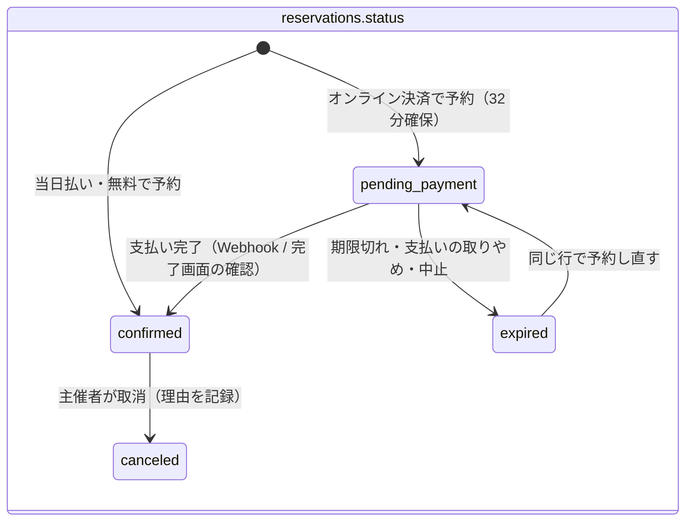
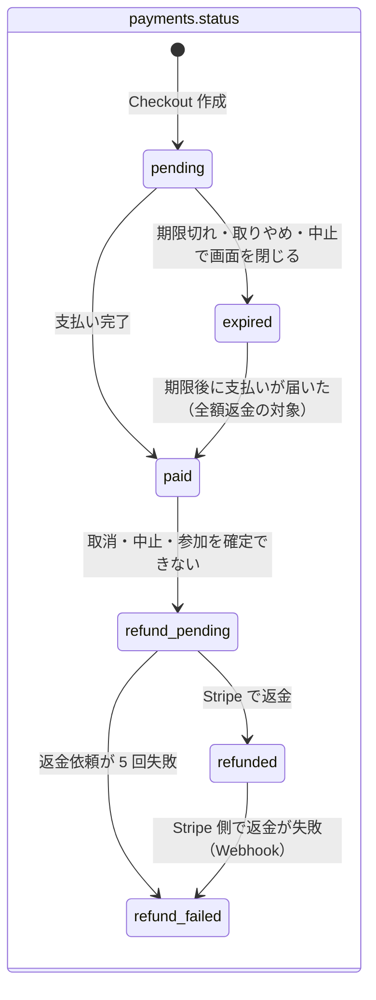

# ER 図

最終更新日: 2026-10-05

MySQL 上のテーブル（`users` / `workshops` / `reservations` / `payments` / `stripe_events` / `favorites` / `facilitator_follows` / `notifications` / `inquiries` / `inquiry_messages`）の構造とリレーションを示す。SQLAlchemy モデル（`backend/app/models/`）を正とし、Alembic マイグレーション（最新は `0020`）および `backend/schema.sql` との整合性を末尾に記載する。

## ER 図

`stripe_events` は他のテーブルと外部キーを持たない独立したテーブル（Webhook の処理済みイベントの記録）。

### リレーションの補足

| 親 | 子 | カーディナリティ | 根拠 | 削除時の扱い |
|---|---|---|---|---|
| users | workshops | 1 対 0..多 | `workshops.facilitator_id` FK（NOT NULL） | ORM・DB ともにカスケード指定なし |
| users | reservations | 1 対 0..多 | `reservations.user_id` FK | ORM・DB ともにカスケード指定なし |
| workshops | reservations | 1 対 0..多 | `reservations.workshop_id` FK | ORM で `cascade="all, delete-orphan"`。ただしワークショップを削除できるのは下書きだけ（後述） |
| reservations | payments | 1 対 0..多 | `payments.reservation_id` FK（インデックス `ix_payments_reservation_id`） | ORM で `passive_deletes="all"`（予約を ORM で消しても支払いは消さず、DB の外部キーで削除を止める。`backend/app/models/reservation.py:84-87`） |
| users | favorites | 1 対 0..多 | `favorites.user_id` FK | ORM で `cascade="all, delete-orphan"` |
| workshops | favorites | 1 対 0..多 | `favorites.workshop_id` FK | ORM で `cascade="all, delete-orphan"` |
| users | notifications | 1 対 0..多 | `notifications.user_id` FK | ORM で `cascade="all, delete-orphan"` |
| workshops | notifications | 1 対 0..多 | `notifications.workshop_id` FK | ORM で `cascade="all, delete-orphan"` |
| users（フォローする側） | facilitator_follows | 1 対 0..多 | `facilitator_follows.follower_id` FK | ORM で `cascade="all, delete-orphan"`（`User.following`） |
| users（フォローされる主催者） | facilitator_follows | 1 対 0..多 | `facilitator_follows.facilitator_id` FK | ORM で `cascade="all, delete-orphan"`（`User.followers`） |
| workshops | inquiries | 1 対 0..多 | `inquiries.workshop_id` FK | ORM で `cascade="all, delete-orphan"`（`Workshop.inquiries`） |
| users（問い合わせた参加者） | inquiries | 1 対 0..多 | `inquiries.participant_id` FK | カスケード指定なし |
| inquiries | inquiry_messages | 1 対 0..多 | `inquiry_messages.inquiry_id` FK（インデックス `ix_inquiry_messages_inquiry_id`） | ORM で `cascade="all, delete-orphan"` |
| users（送信者） | inquiry_messages | 1 対 0..多 | `inquiry_messages.sender_id` FK | カスケード指定なし |

- `reservations` は `(workshop_id, user_id)` の一意制約により、1 ユーザーは 1 ワークショップにつき 1 行のみ。
  - 支払われずに期限が過ぎた予約（`expired`）や、支払い画面を作る前に止まった予約は、予約し直すときに同じ行を使い回す（`backend/app/services/reservations.py:158-203`）。
  - 主催者に取り消された予約（`canceled`）からは再予約できない（409「主催者により参加がキャンセルされたため、このワークショップは予約できません」。`backend/app/services/reservations.py:164-166`）。
- `payments` は予約 1 件に対する Stripe での支払い 1 回分。支払いをやめて予約し直すと試行が増えるため 1 予約に複数ありうる。最新の 1 件（`id` 順の最後）がその予約の「今の支払い」で、`paid` になるのは最大 1 件（`backend/app/models/payment.py:32-36`、`backend/app/services/payments.py:146-148`）。
- `favorites` は `(user_id, workshop_id)` で一意。`users` と `workshops` の多対多を表す中間テーブル。
- `notifications` は `(user_id, workshop_id, type)` で一意。作成時は `_add_missing()` で、同じ種類の通知をまだ受け取っていないユーザーにだけ追加する（`backend/app/services/notifications.py:25-45`）。このため、同じワークショップで 2 回目の返金があっても `payment_refunded` の通知は追加されない（`backend/app/services/notifications.py:92-105`）。
- `facilitator_follows` は `(follower_id, facilitator_id)` で一意。`users` 同士（フォローする側と主催者）の多対多を表す自己参照の中間テーブル。フォロー先は role が `facilitator` のユーザーだけで、admin と自分自身はフォローできない（DB 制約ではなく API 側で判定。`backend/app/services/follows.py`）。
- `inquiries` は `(workshop_id, participant_id)` で一意。参加者と主催者のやり取りをワークショップ × 参加者ごとに 1 つにまとめる（`backend/app/models/inquiry.py:17-21`）。
- DB レベルの外部キーに `ON DELETE` 指定はない。削除のカスケードは SQLAlchemy の ORM セッション経由（`db.delete(workshop)`）でのみ働く。
- `DELETE /api/workshops/{id}` で削除できるのは下書き（`draft`）だけ。公開中・中止のワークショップは記録として残すため 409 を返す（`backend/app/routers/workshops.py:175-197`）。下書きは予約を受け付けないため、カスケードで予約・支払いが削除されることは通常ない（※推測。下書きに予約行が存在しない前提）。

### 予約数（席の確保）の定義

- 予約済み数（`reserved_count`）はカラムとして持たず、「確定済み（`confirmed`）」と「期限内の支払い待ち（`pending_payment` かつ `payment_expires_at > 現在`）」の `ticket_count` 合計で算出する（`backend/app/services/workshops.py:278-316` の `holds_seat()` / `reserved_tickets_select()`）。
- 期限を過ぎた支払い待ちは、状態を `expired` に変える前でも数えない。状態の片付けは定期処理 `release_stale_holds()` が条件付き UPDATE で行う（`backend/app/services/reservations.py:373-388`）。

### 状態の遷移（予約・支払い）

根拠: `backend/app/models/reservation.py:19-34`、`backend/app/models/payment.py:19-29`、`backend/app/services/reservations.py:140-343`、`backend/app/services/payments.py:171-368`、`backend/app/services/workshops.py:156-180`

- `paid` になった支払いでも、ワークショップが公開中でない・予約が今の支払いではない・定員を超える場合は参加を確定せず、全額返金の対象（`refund_pending`）にする（`backend/app/services/reservations.py:206-235`）。
- 中止（`POST /api/workshops/{id}/cancel`）では、確定済み予約の支払いを全額返金の対象にし（予約は `confirmed` のまま残す）、支払い待ちの予約を `expired` にする（`backend/app/services/workshops.py:156-180`）。

### 日時の扱い（タイムゾーン）

- DB の DATETIME はすべてタイムゾーンなしの UTC として保存する。DB 接続時に `SET time_zone = '+00:00'` を実行するため、`CURRENT_TIMESTAMP` による `created_at` の既定値も UTC になる（`backend/app/database.py:15-21`）。
- API の入力（`WorkshopInput.start_at` / `end_at` など）は `NaiveUTCDateTime` で UTC に変換したうえでタイムゾーン情報を外してから保存する。API の応答は `UTCDateTime` で UTC のタイムゾーン付き（`Z` 付き）の日時として返す（`backend/app/schemas/types.py`、`backend/app/schemas/workshop.py`、`backend/app/schemas/reservation.py`）。

### トランザクションの隔離レベル

- DB 接続は `isolation_level="READ COMMITTED"` に固定している。`lock_workshop()`（`SELECT ... FOR UPDATE`）で行をロックした後の予約数の集計で、他のリクエストが確定した予約を見えるようにするため（MySQL 既定の REPEATABLE READ ではスナップショットを読み、定員を超えて受け付けてしまう）（`backend/app/database.py:12-17`）。

## テーブル定義

「デフォルト」列は、モデルの Python 側 `default`（ORM 経由で INSERT したときに適用）と DB 側 `server_default`（マイグレーション / `schema.sql`）を区別して記載する。

### users（ユーザー）

根拠: `backend/app/models/user.py`、`backend/alembic/versions/0001`、`0003`、`0012`、`0018`

| カラム名 | 型 | NULL | デフォルト | 制約 | 説明 |
|---|---|---|---|---|---|
| id | INTEGER | 不可 | AUTO_INCREMENT | PK | ユーザー ID |
| email | VARCHAR(255) | 不可 | — | UK（一意インデックス `ix_users_email`） | メールアドレス。登録・ログイン時に小文字化 |
| name | VARCHAR(255) | 不可 | — | — | 表示名 |
| hashed_password | VARCHAR(255) | 不可 | — | — | bcrypt ハッシュ（`backend/app/core/security.py`） |
| role | ENUM('admin','facilitator','participant') | 不可 | ORM: `participant` / DB: `'participant'` | — | ロール。自己登録は facilitator / participant のみ |
| bio | TEXT | 不可 | ORM: `""` / DB: `''` | — | 自己紹介（API 側で最大 2000 文字） |
| avatar_url | VARCHAR(2000) | 不可 | ORM: `""` / DB: `''` | — | アイコン画像の URL。未設定は空文字 |
| stripe_account_id | VARCHAR(255) | 可 | — | UK `uq_users_stripe_account_id` | 参加費を受け取る Stripe の連結アカウント（Express。`acct_...`）。受け取り設定を始めるまでは NULL |
| stripe_charges_enabled | BOOLEAN | 不可 | ORM: `False` / DB: `0` | — | Stripe の審査が済み、カード決済を受け付けられるか。Stripe のアカウント情報（API / Webhook `account.updated`）から同期する |
| created_at | DATETIME | 不可 | DB: `CURRENT_TIMESTAMP` | — | 作成日時（UTC） |

- 受け取り設定の状態は `stripe_account_id` と `stripe_charges_enabled` から導く: `stripe_account_id` が NULL → `not_registered`、`stripe_charges_enabled` が真 → `enabled`、それ以外 → `pending`（`backend/app/services/payments.py:60-65`）。

### workshops（ワークショップ）

根拠: `backend/app/models/workshop.py`、`backend/alembic/versions/0001`、`0002`、`0004`、`0006`、`0007`、`0011`、`0016`、`0018`、`0020`

| カラム名 | 型 | NULL | デフォルト | 制約 | 説明 |
|---|---|---|---|---|---|
| id | INTEGER | 不可 | AUTO_INCREMENT | PK | ワークショップ ID |
| title | VARCHAR(255) | 不可 | — | — | タイトル（API: 1〜50 文字） |
| description | TEXT | 不可 | ORM: `""` | — | 説明（API: 必須、1〜1000 文字） |
| image_url | VARCHAR(2000) | 不可 | ORM: `""` / DB: `''` | — | 画像 URL（`/api/uploads/workshops/<uuid>.<ext>`）。未設定は空文字 |
| location_type | ENUM('online','offline') | 不可 | ORM: `offline` / DB: `'offline'` | — | 開催形式 |
| location | VARCHAR(255) | 不可 | ORM: `""` | — | 会場名・住所、またはオンラインツール・URL（API: 1〜255 文字） |
| start_at | DATETIME | 不可 | — | — | 開始日時。タイムゾーンなし（UTC として扱う） |
| end_at | DATETIME | 不可 | — | — | 終了日時（API で `end_at > start_at` を検証） |
| capacity | INTEGER | 不可 | ORM: `10` / DB: `10` | — | 定員（チケット枚数ベース。API: 1〜100） |
| price | INTEGER | 不可 | ORM: `0` / DB: `0` | — | 参加費（円）。0 は無料（API: 0〜100,000） |
| payment_method | ENUM('onsite','online') | 不可 | ORM: `onsite` / DB: `'onsite'` | — | 参加費の支払方法。`onsite` = 当日会場で支払い、`online` = 予約時に Stripe でカード決済。無料（`price = 0`）なら API が `onsite` に揃える。`online` の参加費は 50 円以上（`ONLINE_PAYMENT_MIN_PRICE`）（`backend/app/schemas/workshop.py:15-17, 43-54`） |
| participant_guide | TEXT | 不可 | ORM: `""` / DB: `''` | — | 当日の案内（集合場所・持ち物・参加 URL など）。予約が確定した参加者と主催者・運営にだけ返す。開催前日に主催者からのメッセージとして送る（API: 最大 2000 文字） |
| emergency_contact | VARCHAR(255) | 不可 | ORM: `""` / DB: `''` | — | 当日の緊急連絡先。公開範囲は `participant_guide` と同じ |
| status | ENUM('draft','published','canceled') | 不可 | ORM: `draft` / DB: `'draft'` | — | 公開状態 |
| facilitator_id | INTEGER | 不可 | — | FK → users.id | 主催者 |
| published_at | DATETIME | 可 | — | — | 初めて公開（published）になった日時（UTC）。ORM のイベントで自動設定し、以後変わらない。一覧の「公開日時の新しい順」に使う |
| created_at | DATETIME | 不可 | DB: `CURRENT_TIMESTAMP` | — | 作成日時（UTC） |

- 公開中のワークショップは、参加費・支払方法・開始日時・終了日時・開催形式・場所を変更できない（API が 409。`backend/app/services/workshops.py:133-148`）。
- `payment_method = 'online'` で新しく公開するには、運営側でオンライン決済が有効（`STRIPE_SECRET_KEY` 設定済み）かつ主催者の受け取り設定が `enabled` である必要がある。下書きのうちは受け取り設定の前でも保存できる（`backend/app/services/workshops.py:78-93`）。
- ワークショップごとのキャンセルポリシー（自由記述の `cancellation_policy`。0006 で追加）は 0020 で削除した。オンライン決済の返金額に主催者独自のキャンセル料を反映できず、記載と実際の返金額が食い違うため、キャンセルと返金は本サービス共通のキャンセルポリシー（`/help/cancellation-policy`）に従う（`backend/alembic/versions/0020_drop_workshop_cancellation_policy.py:20-22`）。ダウングレードすると列は空文字で戻るが、削除した文章は戻らない。

### reservations（予約）

根拠: `backend/app/models/reservation.py`、`backend/alembic/versions/0001`、`0005`、`0010`、`0016`、`0018`

| カラム名 | 型 | NULL | デフォルト | 制約 | 説明 |
|---|---|---|---|---|---|
| id | INTEGER | 不可 | AUTO_INCREMENT | PK | 予約 ID |
| workshop_id | INTEGER | 不可 | — | FK → workshops.id、UK `uq_reservation_workshop_user`(workshop_id, user_id) | 対象ワークショップ |
| user_id | INTEGER | 不可 | — | FK → users.id、UK（同上） | 予約したユーザー |
| attendee_name | VARCHAR(255) | 不可 | ORM: `""` / DB: `''` | — | 参加者名。予約時にアカウント名を入れる（入力欄はない。`backend/app/services/reservations.py:185-186`） |
| contact | VARCHAR(255) | 不可 | ORM: `""` / DB: `''` | — | 連絡先メールアドレス（API: `EmailAddress`）。オンライン決済では Checkout の `customer_email` にも使う |
| ticket_count | INTEGER | 不可 | ORM: `1` / DB: `1` | CHECK `ck_reservation_ticket_count`(1〜4) | チケット枚数（API: 1〜4。定数 `MAX_TICKETS_PER_RESERVATION`） |
| status | ENUM('confirmed','canceled','pending_payment','expired') | 不可 | ORM: `confirmed` / DB: `'confirmed'` | — | 予約状態。`pending_payment` = オンライン決済の支払い待ち（期限まで席を確保）、`expired` = 支払われないまま期限切れ・取りやめ。`canceled` は主催者による取消のみ（参加者は自分で取り消せない） |
| attendance | ENUM('unconfirmed','present','absent') | 不可 | ORM: `unconfirmed` / DB: `'unconfirmed'` | — | 開催当日に主催者が記録する出欠（開始 24 時間前から、開催後も修正可） |
| payment_expires_at | DATETIME | 可 | — | — | 支払い待ちの席を確保しておく期限（予約時刻 + 32 分。`PAYMENT_HOLD`）。確定時に NULL に戻す |
| cancel_reason | ENUM('participant','facilitator') | 可 | — | — | 主催者が取り消したときの理由。`participant` = 参加者の申し出（手数料を差し引いて返金）、`facilitator` = 主催者の都合（全額返金） |
| created_at | DATETIME | 不可 | DB: `CURRENT_TIMESTAMP` | — | 予約日時（UTC） |

- `GET /api/reservations/me` と `GET /api/workshops/{id}/reservations` は `expired` の予約を返さない（予約しなかったのと同じ扱い。`backend/app/routers/reservations.py:30-36`、`backend/app/routers/workshops.py:242-245`）。

### payments（支払い）

根拠: `backend/app/models/payment.py`、`backend/alembic/versions/0018_add_online_payment.py`、`0019_payment_refund_id.py`

| カラム名 | 型 | NULL | デフォルト | 制約 | 説明 |
|---|---|---|---|---|---|
| id | INTEGER | 不可 | AUTO_INCREMENT | PK | 支払い ID |
| reservation_id | INTEGER | 不可 | — | FK → reservations.id、インデックス `ix_payments_reservation_id` | 対象の予約 |
| stripe_account_id | VARCHAR(255) | 不可 | — | — | 決済した主催者の連結アカウント。主催者のアカウントが後で変わっても、この支払いの取得・返金はここで行う |
| stripe_checkout_session_id | VARCHAR(255) | 可 | — | UK `uq_payments_stripe_checkout_session_id` | Checkout Session の ID（`cs_...`）。Stripe 呼び出し前は NULL |
| stripe_payment_intent_id | VARCHAR(255) | 可 | — | UK `uq_payments_stripe_payment_intent_id` | PaymentIntent の ID（`pi_...`）。支払い完了時に記録。返金失敗の Webhook の照合に使う |
| stripe_refund_id | VARCHAR(255) | 可 | — | — | 返金の ID（`re_...`）。運営の手動対応や Stripe 側の返金との照合に使う（0019 で追加） |
| amount | INTEGER | 不可 | — | CHECK `ck_payments_amount`(amount > 0) | 参加者が支払う金額（参加費 × 枚数）。予約時の値を残す |
| application_fee_amount | INTEGER | 不可 | — | CHECK `ck_payments_application_fee`(0 以上 amount 以下) | 運営の手数料（`amount × PLATFORM_FEE_PERCENT ÷ 100`、1 円未満切り捨て） |
| stripe_fee_amount | INTEGER | 可 | — | — | Stripe の決済手数料。支払い完了時に Stripe から実際の額を取得する |
| refund_amount | INTEGER | 可 | — | CHECK `ck_payments_refund`(NULL または 0 以上 amount 以下) | 返金が決まったときに確定する返金額 |
| currency | VARCHAR(3) | 不可 | ORM: `jpy` | — | 通貨 |
| status | ENUM('pending','paid','expired','refund_pending','refunded','refund_failed') | 不可 | ORM: `pending` | — | 支払い状態（上記の状態遷移図を参照） |
| refund_attempts | INTEGER | 不可 | ORM: `0` / DB: `0` | CHECK `ck_payments_refund_attempts`(>= 0) | 返金の依頼に失敗した回数。5 回（`MAX_REFUND_ATTEMPTS`）に達したら `refund_failed` |
| paid_at | DATETIME | 可 | — | — | 支払い完了日時（UTC） |
| refunded_at | DATETIME | 可 | — | — | 返金完了日時（UTC） |
| created_at | DATETIME | 不可 | DB: `CURRENT_TIMESTAMP` | — | 作成日時（UTC） |

- 返金額は `refund_amount_for()` だけで定義する: 主催者都合（`facilitator`）は全額、参加者都合（`participant`）は `amount - stripe_fee_amount - application_fee_amount`（0 未満は 0）（`backend/app/services/payments.py:234-242`）。中止・参加を確定できない支払いは主催者都合と同じ全額（`backend/app/services/payments.py:255-261`）。
- 返金額が 0 円のときは Stripe に依頼せずに `refunded` にする（`backend/app/services/payments.py:300-305`）。

### stripe_events（処理済みの Stripe イベント）

根拠: `backend/app/models/stripe_event.py`、`backend/alembic/versions/0018_add_online_payment.py`

| カラム名 | 型 | NULL | デフォルト | 制約 | 説明 |
|---|---|---|---|---|---|
| event_id | VARCHAR(255) | 不可 | — | PK | Stripe のイベント ID（`evt_...`）。同じイベントの再送を二重に処理しないために記録する |
| type | VARCHAR(255) | 不可 | — | — | イベント種別（`checkout.session.completed` など） |
| received_at | DATETIME | 不可 | DB: `CURRENT_TIMESTAMP` | — | 受信日時（UTC） |

### favorites（お気に入り）

根拠: `backend/app/models/favorite.py`、`backend/alembic/versions/0003_bio_and_favorites.py`

| カラム名 | 型 | NULL | デフォルト | 制約 | 説明 |
|---|---|---|---|---|---|
| id | INTEGER | 不可 | AUTO_INCREMENT | PK | お気に入り ID |
| user_id | INTEGER | 不可 | — | FK → users.id、UK `uq_favorite_user_workshop`(user_id, workshop_id) | ユーザー |
| workshop_id | INTEGER | 不可 | — | FK → workshops.id、UK（同上） | ワークショップ |
| created_at | DATETIME | 不可 | DB: `CURRENT_TIMESTAMP` | — | 登録日時（UTC。一覧の並び順に使用） |

### notifications（通知）

根拠: `backend/app/models/notification.py`、`backend/alembic/versions/0008`、`0013`、`0017`、`0018`、`0019`

| カラム名 | 型 | NULL | デフォルト | 制約 | 説明 |
|---|---|---|---|---|---|
| id | INTEGER | 不可 | AUTO_INCREMENT | PK | 通知 ID |
| user_id | INTEGER | 不可 | — | FK → users.id、UK `uq_notification_user_workshop_type`(user_id, workshop_id, type) | 宛先ユーザー |
| workshop_id | INTEGER | 不可 | — | FK → workshops.id、UK（同上） | 対象ワークショップ |
| type | ENUM('cancellation','reminder','reservation_canceled','new_workshop','payment_refunded','payment_refund_failed') | 不可 | — | UK（同上） | 種別（下表） |
| message | TEXT | 不可 | — | — | 本文 |
| is_read | BOOLEAN | 不可 | ORM: `False` / DB: `false` | — | 既読フラグ |
| created_at | DATETIME | 不可 | DB: `CURRENT_TIMESTAMP` | — | 作成日時（UTC） |

| type | 意味 | 作成のきっかけ | 根拠 |
|---|---|---|---|
| `cancellation` | ワークショップの中止 | 主催者の中止操作。オンライン決済で返金がある場合は「オンラインでお支払いいただいた参加費は全額返金します。」を追記 | `backend/app/services/notifications.py:48-60` |
| `reminder` | 開催前日のリマインダー | 定期処理（開始 25 時間以内の公開中ワークショップ） | `backend/app/services/notifications.py:188-226` |
| `reservation_canceled` | 主催者による参加の取消 | 主催者の取消操作。支払い済みなら理由と返金額を本文に含める | `backend/app/services/notifications.py:63-89` |
| `new_workshop` | フォロー中の主催者の新着 | ワークショップの初回公開。持ち主の role が facilitator のときだけ。中止すると削除する | `backend/app/services/notifications.py:121-150` |
| `payment_refunded` | 参加費の返金完了 | 返金処理の成功（返金額が 1 円以上のとき） | `backend/app/services/notifications.py:92-105`、`backend/app/services/payments.py:276-280` |
| `payment_refund_failed` | 返金済みと知らせた後に Stripe 側で返金が失敗 | Webhook（`charge.refund.updated` / `refund.failed`） | `backend/app/services/notifications.py:108-118`、`backend/app/services/payments.py:355-368` |

### facilitator_follows（主催者フォロー）

根拠: `backend/app/models/follow.py`、`backend/alembic/versions/0017_facilitator_follows.py`

| カラム名 | 型 | NULL | デフォルト | 制約 | 説明 |
|---|---|---|---|---|---|
| id | INTEGER | 不可 | AUTO_INCREMENT | PK | フォロー ID |
| follower_id | INTEGER | 不可 | — | FK → users.id、UK `uq_follow_follower_facilitator`(follower_id, facilitator_id) | フォローしたユーザー（ロールは問わない） |
| facilitator_id | INTEGER | 不可 | — | FK → users.id、UK（同上）、インデックス `ix_facilitator_follows_facilitator_id` | フォローされた主催者 |
| created_at | DATETIME | 不可 | DB: `CURRENT_TIMESTAMP` | — | フォロー日時（UTC） |

### inquiries（問い合わせ）

根拠: `backend/app/models/inquiry.py`、`backend/alembic/versions/0014_inquiries.py`

| カラム名 | 型 | NULL | デフォルト | 制約 | 説明 |
|---|---|---|---|---|---|
| id | INTEGER | 不可 | AUTO_INCREMENT | PK | 問い合わせ ID |
| workshop_id | INTEGER | 不可 | — | FK → workshops.id、UK `uq_inquiry_workshop_participant`(workshop_id, participant_id) | 対象ワークショップ（相手はその主催者） |
| participant_id | INTEGER | 不可 | — | FK → users.id、UK（同上） | 問い合わせた側のユーザー |
| last_message_at | DATETIME | 不可 | — | — | 最後のメッセージの日時（一覧の並び順） |
| participant_last_read_id | INTEGER | 不可 | ORM: `0` / DB: `0` | — | 参加者が最後に読んだメッセージ ID（未読判定に使う） |
| facilitator_last_read_id | INTEGER | 不可 | ORM: `0` / DB: `0` | — | 主催者が最後に読んだメッセージ ID |
| created_at | DATETIME | 不可 | DB: `CURRENT_TIMESTAMP` | — | 作成日時（UTC） |

### inquiry_messages（問い合わせのメッセージ）

根拠: `backend/app/models/inquiry.py`、`backend/alembic/versions/0014_inquiries.py`、`0015_inquiry_message_broadcast.py`

| カラム名 | 型 | NULL | デフォルト | 制約 | 説明 |
|---|---|---|---|---|---|
| id | INTEGER | 不可 | AUTO_INCREMENT | PK | メッセージ ID |
| inquiry_id | INTEGER | 不可 | — | FK → inquiries.id、インデックス `ix_inquiry_messages_inquiry_id` | 所属する問い合わせ |
| sender_id | INTEGER | 不可 | — | FK → users.id | 送信者 |
| body | TEXT | 不可 | — | — | 本文（API: 最大 2000 文字。`INQUIRY_MESSAGE_MAX_LENGTH`） |
| is_broadcast | BOOLEAN | 不可 | ORM: `False` / DB: `false` | — | 主催者が参加者全員に一斉送信したお知らせか（当日の案内の自動送信も一斉送信として追加される） |
| created_at | DATETIME | 不可 | DB: `CURRENT_TIMESTAMP` | — | 送信日時（UTC） |

## マイグレーション履歴

| リビジョン | 内容 | ファイル |
|---|---|---|
| 0001 | `users` / `workshops` / `reservations` 作成、`ix_users_email` | `backend/alembic/versions/0001_initial_schema.py` |
| 0002 | `workshops.price` 追加 | `backend/alembic/versions/0002_add_workshop_price.py` |
| 0003 | `users.bio` 追加、`favorites` 作成 | `backend/alembic/versions/0003_bio_and_favorites.py` |
| 0004 | `workshops.location_type` 追加 | `backend/alembic/versions/0004_workshop_location_type.py` |
| 0005 | `reservations.attendee_name` / `contact` / `ticket_count` 追加（既存行はユーザー名・メールで補完） | `backend/alembic/versions/0005_reservation_attendee_fields.py` |
| 0006 | `workshops.cancellation_policy` 追加（0020 で削除） | `backend/alembic/versions/0006_workshop_cancellation_policy.py` |
| 0007 | `workshops.image_url` 追加 | `backend/alembic/versions/0007_workshop_image_url.py` |
| 0008 | `notifications` 作成 | `backend/alembic/versions/0008_notifications.py` |
| 0009 | 全 5 テーブルの `created_at` を NOT NULL 化（既存の NULL 行は `CURRENT_TIMESTAMP` で補完） | `backend/alembic/versions/0009_created_at_not_null.py` |
| 0010 | `reservations.ticket_count` に CHECK 制約 `ck_reservation_ticket_count`（1〜4）を追加 | `backend/alembic/versions/0010_reservation_ticket_count_check.py` |
| 0011 | `workshops.published_at` 追加（既存の公開中データは `created_at` で補完） | `backend/alembic/versions/0011_workshop_published_at.py` |
| 0012 | `users.avatar_url` 追加 | `backend/alembic/versions/0012_user_avatar_url.py` |
| 0013 | `notifications.type` に `reservation_canceled` を追加 | `backend/alembic/versions/0013_notification_reservation_canceled.py` |
| 0014 | `inquiries` / `inquiry_messages` 作成（一意制約 `uq_inquiry_workshop_participant`、インデックス `ix_inquiry_messages_inquiry_id`） | `backend/alembic/versions/0014_inquiries.py` |
| 0015 | `inquiry_messages.is_broadcast` 追加 | `backend/alembic/versions/0015_inquiry_message_broadcast.py` |
| 0016 | `workshops.participant_guide` / `emergency_contact`、`reservations.attendance` 追加 | `backend/alembic/versions/0016_participant_guide_and_attendance.py` |
| 0017 | `facilitator_follows` 作成、`notifications.type` に `new_workshop` を追加 | `backend/alembic/versions/0017_facilitator_follows.py` |
| 0018 | オンライン決済: `users.stripe_account_id`（UK）/ `stripe_charges_enabled`、`workshops.payment_method`（既存行は `onsite`）、`reservations.status` に `pending_payment` / `expired` を追加、`reservations.payment_expires_at` / `cancel_reason`、`payments` / `stripe_events` 作成、`notifications.type` に `payment_refunded` を追加。ダウングレード時は `pending_payment` / `expired` の予約を `canceled` に、`payment_refunded` の通知を削除してから型を戻す | `backend/alembic/versions/0018_add_online_payment.py` |
| 0019 | `payments.stripe_refund_id` 追加、`notifications.type` に `payment_refund_failed` を追加 | `backend/alembic/versions/0019_payment_refund_id.py` |
| 0020 | `workshops.cancellation_policy` 削除（主催者ごとのキャンセルポリシーを廃止し、本サービス共通のキャンセルポリシーにそろえる）。ダウングレード時は列を空文字の既定値で戻す（文章は戻らない） | `backend/alembic/versions/0020_drop_workshop_cancellation_policy.py` |

## 定義間の整合性

モデル（`app/models/*.py`）、マイグレーション（`0001`〜`0020`）、`backend/schema.sql`（冒頭コメントに「up to 0020」と記載）の 3 つで、全 10 テーブルのカラム構成・型・NULL 可否・DB デフォルト・制約・インデックスは一致している。細かな差は次のとおり（いずれも動作上の差はない）。

- `payments.currency` と `payments.status` は DB 側の既定値を持たず、ORM の `default`（`jpy` / `pending`）でのみ補う（`backend/app/models/payment.py:69-72`、`backend/schema.sql:72-73`）。
- `users.stripe_charges_enabled` の既定値は、マイグレーション 0018 が `0`、`schema.sql` が `FALSE`（MySQL では同じ値）。
- `inquiry_messages.is_broadcast` の型は `schema.sql` では `BOOL`、他は `BOOLEAN`（MySQL ではどちらも `TINYINT(1)`）。
- `users.bio` / `workshops.participant_guide`（TEXT 型）の `DEFAULT ''` は、`schema.sql` とマイグレーションの両方にある。MySQL は TEXT 型にリテラルの既定値を付けることを制限しているため、MySQL のバージョンや SQL モードによっては DDL がエラーまたは警告になる可能性がある（※推測。実行しての確認はしていない）。

---

参照したファイル:
- `backend/app/models/__init__.py`
- `backend/app/models/user.py`
- `backend/app/models/workshop.py`
- `backend/app/models/reservation.py`
- `backend/app/models/payment.py`
- `backend/app/models/stripe_event.py`
- `backend/app/models/favorite.py`
- `backend/app/models/notification.py`
- `backend/app/models/follow.py`
- `backend/app/models/inquiry.py`
- `backend/alembic/versions/0001_initial_schema.py` 〜 `0020_drop_workshop_cancellation_policy.py`
- `backend/schema.sql`
- `backend/app/database.py`
- `backend/app/schemas/types.py`
- `backend/app/schemas/workshop.py`
- `backend/app/schemas/reservation.py`
- `backend/app/services/workshops.py`
- `backend/app/services/reservations.py`
- `backend/app/services/payments.py`
- `backend/app/services/notifications.py`
- `backend/app/services/follows.py`
- `backend/app/routers/workshops.py`
- `backend/app/routers/reservations.py`
