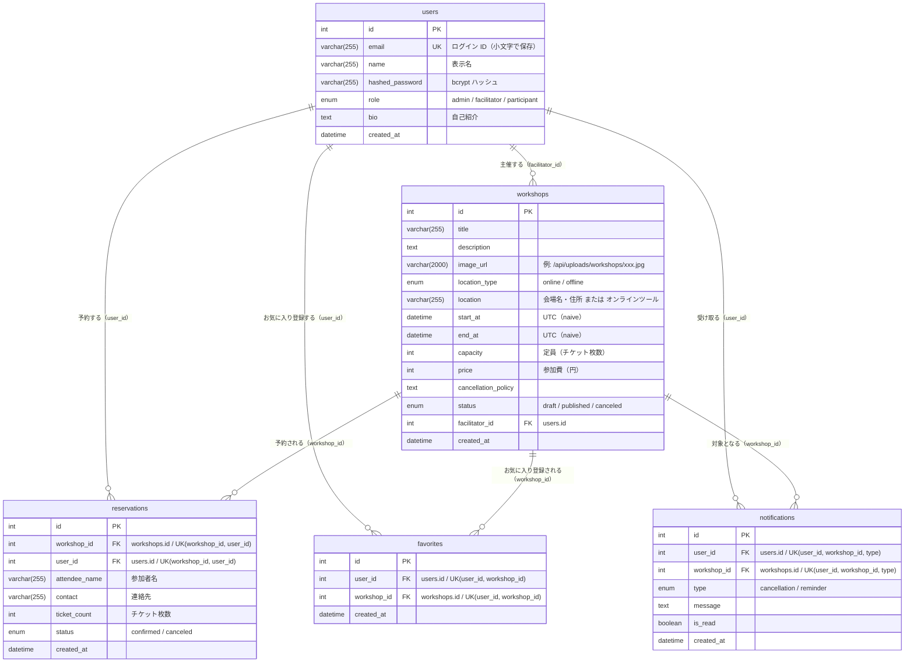

# ER 図

最終更新日: 2026-09-25

MySQL 上の全 5 テーブル（`users` / `workshops` / `reservations` / `favorites` / `notifications`）の構造とリレーションを示す。SQLAlchemy モデル（`backend/app/models/`）を正とし、Alembic マイグレーション（最新 `0009`）および `backend/schema.sql` との整合性を末尾に記載する。

## ER 図

### リレーションの補足

| 親 | 子 | カーディナリティ | 根拠 | 削除時の扱い |
|---|---|---|---|---|
| users | workshops | 1 対 0..多 | `workshops.facilitator_id` FK（NOT NULL） | ORM・DB ともにカスケード指定なし |
| users | reservations | 1 対 0..多 | `reservations.user_id` FK | ORM・DB ともにカスケード指定なし |
| workshops | reservations | 1 対 0..多 | `reservations.workshop_id` FK | ORM で `cascade="all, delete-orphan"`（ワークショップ削除時に一緒に削除）。ただし確定済み予約が 1 件でもあるワークショップは API が削除を拒否（409） |
| users | favorites | 1 対 0..多 | `favorites.user_id` FK | ORM で `cascade="all, delete-orphan"` |
| workshops | favorites | 1 対 0..多 | `favorites.workshop_id` FK | ORM で `cascade="all, delete-orphan"` |
| users | notifications | 1 対 0..多 | `notifications.user_id` FK | ORM で `cascade="all, delete-orphan"` |
| workshops | notifications | 1 対 0..多 | `notifications.workshop_id` FK | ORM で `cascade="all, delete-orphan"` |

- `reservations` は `(workshop_id, user_id)` の一意制約により、1 ユーザーは 1 ワークショップにつき 1 行のみ。キャンセル後に再予約すると、同じ行の `status` を `confirmed` に戻して再利用する（`backend/app/routers/workshops.py:212-224`）。
- `favorites` は `(user_id, workshop_id)` で一意。`users` と `workshops` の多対多を表す中間テーブル。
- `notifications` は `(user_id, workshop_id, type)` で一意。同じユーザー・ワークショップ・種別の通知は 1 件しか作られない（重複作成時は `IntegrityError` をロールバックして無視。`backend/app/services/notifications.py:26-33`）。
- DB レベルの外部キーに `ON DELETE` 指定はない。削除のカスケードは SQLAlchemy の ORM セッション経由（`db.delete(workshop)`）でのみ働く（`backend/app/models/workshop.py`、`backend/app/models/user.py` の relationship 定義）。
- `DELETE /api/workshops/{id}` は、確定済み予約のチケット合計（`reserved_count`）が 1 以上なら 409 を返して削除しない。このため、カスケードで削除される予約はキャンセル済みのものだけになる（`backend/app/routers/workshops.py:180-195`）。

### 日時の扱い（タイムゾーン）

- DB の DATETIME はすべてタイムゾーンなしの UTC として保存する。DB 接続時に `SET time_zone = '+00:00'` を実行するため、`CURRENT_TIMESTAMP` による `created_at` の既定値も UTC になる（`backend/app/database.py:8-13`）。
- API の入力（`WorkshopInput.start_at` / `end_at`）は `NaiveUTCDateTime` で UTC に変換したうえでタイムゾーン情報を外してから保存する。API の応答（`start_at` / `end_at` / `created_at`）は `UTCDateTime` で UTC のタイムゾーン付き（`Z` 付き）の日時として返す（`backend/app/schemas/types.py`、`backend/app/schemas/workshop.py:12-13, 42-43`、`backend/app/schemas/reservation.py:26`、`backend/app/schemas/notification.py:16`）。

## テーブル定義

「デフォルト」列は、モデルの Python 側 `default`（ORM 経由で INSERT したときに適用）と DB 側 `server_default`（マイグレーション）を区別して記載する。

### users（ユーザー）

根拠: `backend/app/models/user.py`、`backend/alembic/versions/0001_initial_schema.py`、`0003_bio_and_favorites.py`

| カラム名 | 型 | NULL | デフォルト | 制約 | 説明 |
|---|---|---|---|---|---|
| id | INTEGER | 不可 | AUTO_INCREMENT | PK | ユーザー ID |
| email | VARCHAR(255) | 不可 | — | UK（一意インデックス `ix_users_email`） | メールアドレス。登録・ログイン時に小文字化（`backend/app/routers/auth.py:19, 39`） |
| name | VARCHAR(255) | 不可 | — | — | 表示名 |
| hashed_password | VARCHAR(255) | 不可 | — | — | bcrypt ハッシュ（`backend/app/core/security.py`） |
| role | ENUM('admin','facilitator','participant') | 不可 | ORM: `participant` / DB: `'participant'` | — | ロール。自己登録は facilitator / participant のみ |
| bio | TEXT | 不可 | ORM: `""` / DB: `''` | — | 自己紹介（API 側で最大 2000 文字） |
| created_at | DATETIME | 不可 | DB: `CURRENT_TIMESTAMP` | — | 作成日時（UTC） |

### workshops（ワークショップ）

根拠: `backend/app/models/workshop.py`、`backend/alembic/versions/0001`、`0002`、`0004`、`0006`、`0007`

| カラム名 | 型 | NULL | デフォルト | 制約 | 説明 |
|---|---|---|---|---|---|
| id | INTEGER | 不可 | AUTO_INCREMENT | PK | ワークショップ ID |
| title | VARCHAR(255) | 不可 | — | — | タイトル（API: 1〜255 文字） |
| description | TEXT | 不可 | ORM: `""` | — | 説明 |
| image_url | VARCHAR(2000) | 不可 | ORM: `""` / DB: `''` | — | 画像 URL（`/api/uploads/workshops/<uuid>.<ext>`）。未設定は空文字 |
| location_type | ENUM('online','offline') | 不可 | ORM: `offline` / DB: `'offline'` | — | 開催形式 |
| location | VARCHAR(255) | 不可 | ORM: `""` | — | 会場名・住所、またはオンラインツール・URL（API: 1〜255 文字） |
| start_at | DATETIME | 不可 | — | — | 開始日時。タイムゾーンなし（UTC として扱う。`backend/app/services/notifications.py:43`） |
| end_at | DATETIME | 不可 | — | — | 終了日時（API で `end_at > start_at` を検証） |
| capacity | INTEGER | 不可 | ORM: `10` / DB: `10` | — | 定員（チケット枚数ベース。API: 1〜10000） |
| price | INTEGER | 不可 | ORM: `0` / DB: `0` | — | 参加費（円）。0 は無料（API: 0〜10,000,000） |
| cancellation_policy | TEXT | 不可 | ORM: `""` / DB: `''` | — | キャンセルポリシー（API: 最大 2000 文字） |
| status | ENUM('draft','published','canceled') | 不可 | ORM: `draft` / DB: `'draft'` | — | 公開状態 |
| facilitator_id | INTEGER | 不可 | — | FK → users.id | 主催者 |
| created_at | DATETIME | 不可 | DB: `CURRENT_TIMESTAMP` | — | 作成日時（UTC） |

### reservations（予約）

根拠: `backend/app/models/reservation.py`、`backend/alembic/versions/0001`、`0005`

| カラム名 | 型 | NULL | デフォルト | 制約 | 説明 |
|---|---|---|---|---|---|
| id | INTEGER | 不可 | AUTO_INCREMENT | PK | 予約 ID |
| workshop_id | INTEGER | 不可 | — | FK → workshops.id、UK `uq_reservation_workshop_user`(workshop_id, user_id) | 対象ワークショップ |
| user_id | INTEGER | 不可 | — | FK → users.id、UK（同上） | 予約したユーザー |
| attendee_name | VARCHAR(255) | 不可 | ORM: `""` / DB: `''` | — | 参加者名（API: 1〜255 文字） |
| contact | VARCHAR(255) | 不可 | ORM: `""` / DB: `''` | — | 連絡先（API: 1〜255 文字） |
| ticket_count | INTEGER | 不可 | ORM: `1` / DB: `1` | — | チケット枚数（API: 1〜20） |
| status | ENUM('confirmed','canceled') | 不可 | ORM: `confirmed` / DB: `'confirmed'` | — | 予約状態。キャンセルは論理（status 更新） |
| created_at | DATETIME | 不可 | DB: `CURRENT_TIMESTAMP` | — | 予約日時（UTC） |

- 予約済み数（`reserved_count`）は `status = 'confirmed'` の `ticket_count` 合計で算出し、カラムとしては持たない（`backend/app/services/workshops.py:11-16`）。

### favorites（お気に入り）

根拠: `backend/app/models/favorite.py`、`backend/alembic/versions/0003_bio_and_favorites.py`

| カラム名 | 型 | NULL | デフォルト | 制約 | 説明 |
|---|---|---|---|---|---|
| id | INTEGER | 不可 | AUTO_INCREMENT | PK | お気に入り ID |
| user_id | INTEGER | 不可 | — | FK → users.id、UK `uq_favorite_user_workshop`(user_id, workshop_id) | ユーザー |
| workshop_id | INTEGER | 不可 | — | FK → workshops.id、UK（同上） | ワークショップ |
| created_at | DATETIME | 不可 | DB: `CURRENT_TIMESTAMP` | — | 登録日時（UTC。一覧の並び順に使用） |

### notifications（通知）

根拠: `backend/app/models/notification.py`、`backend/alembic/versions/0008_notifications.py`

| カラム名 | 型 | NULL | デフォルト | 制約 | 説明 |
|---|---|---|---|---|---|
| id | INTEGER | 不可 | AUTO_INCREMENT | PK | 通知 ID |
| user_id | INTEGER | 不可 | — | FK → users.id、UK `uq_notification_user_workshop_type`(user_id, workshop_id, type) | 宛先ユーザー |
| workshop_id | INTEGER | 不可 | — | FK → workshops.id、UK（同上） | 対象ワークショップ |
| type | ENUM('cancellation','reminder') | 不可 | — | UK（同上） | 種別（中止 / 開催前日リマインド） |
| message | TEXT | 不可 | — | — | 本文 |
| is_read | BOOLEAN | 不可 | ORM: `False` / DB: `false` | — | 既読フラグ |
| created_at | DATETIME | 不可 | DB: `CURRENT_TIMESTAMP` | — | 作成日時（UTC） |

## マイグレーション履歴

| リビジョン | 内容 | ファイル |
|---|---|---|
| 0001 | `users` / `workshops` / `reservations` 作成、`ix_users_email` | `backend/alembic/versions/0001_initial_schema.py` |
| 0002 | `workshops.price` 追加 | `backend/alembic/versions/0002_add_workshop_price.py` |
| 0003 | `users.bio` 追加、`favorites` 作成 | `backend/alembic/versions/0003_bio_and_favorites.py` |
| 0004 | `workshops.location_type` 追加 | `backend/alembic/versions/0004_workshop_location_type.py` |
| 0005 | `reservations.attendee_name` / `contact` / `ticket_count` 追加（既存行はユーザー名・メールで補完） | `backend/alembic/versions/0005_reservation_attendee_fields.py` |
| 0006 | `workshops.cancellation_policy` 追加 | `backend/alembic/versions/0006_workshop_cancellation_policy.py` |
| 0007 | `workshops.image_url` 追加 | `backend/alembic/versions/0007_workshop_image_url.py` |
| 0008 | `notifications` 作成 | `backend/alembic/versions/0008_notifications.py` |
| 0009 | 全 5 テーブルの `created_at` を NOT NULL 化（既存の NULL 行は `CURRENT_TIMESTAMP` で補完） | `backend/alembic/versions/0009_created_at_not_null.py` |

## 定義間の整合性

モデル（`app/models/`）、最新マイグレーション（0009 まで適用後）、`backend/schema.sql`（冒頭コメントに「up to 0009」と記載）の 3 つで、カラム構成・型・NULL 可否・DB デフォルト・制約は一致している。

- `users.bio` / `workshops.cancellation_policy`（TEXT 型）の `DEFAULT ''` は、`schema.sql` とマイグレーション（0003 / 0006）の両方にある。MySQL は TEXT 型にリテラルの既定値を付けることを制限しているため、MySQL のバージョンや SQL モードによっては DDL がエラーまたは警告になる可能性がある（※推測。実行しての確認はしていない）。

---

参照したファイル:
- `backend/app/models/__init__.py`
- `backend/app/models/user.py`
- `backend/app/models/workshop.py`
- `backend/app/models/reservation.py`
- `backend/app/models/favorite.py`
- `backend/app/models/notification.py`
- `backend/alembic/versions/0001_initial_schema.py`
- `backend/alembic/versions/0002_add_workshop_price.py`
- `backend/alembic/versions/0003_bio_and_favorites.py`
- `backend/alembic/versions/0004_workshop_location_type.py`
- `backend/alembic/versions/0005_reservation_attendee_fields.py`
- `backend/alembic/versions/0006_workshop_cancellation_policy.py`
- `backend/alembic/versions/0007_workshop_image_url.py`
- `backend/alembic/versions/0008_notifications.py`
- `backend/alembic/versions/0009_created_at_not_null.py`
- `backend/schema.sql`
- `backend/app/database.py`
- `backend/app/schemas/types.py`
- `backend/app/schemas/notification.py`
- `backend/app/schemas/workshop.py`
- `backend/app/schemas/reservation.py`
- `backend/app/schemas/user.py`
- `backend/app/services/workshops.py`
- `backend/app/services/notifications.py`
- `backend/app/routers/auth.py`
- `backend/app/routers/workshops.py`
