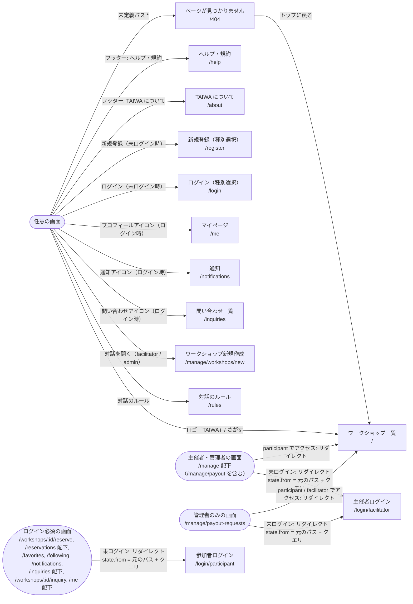
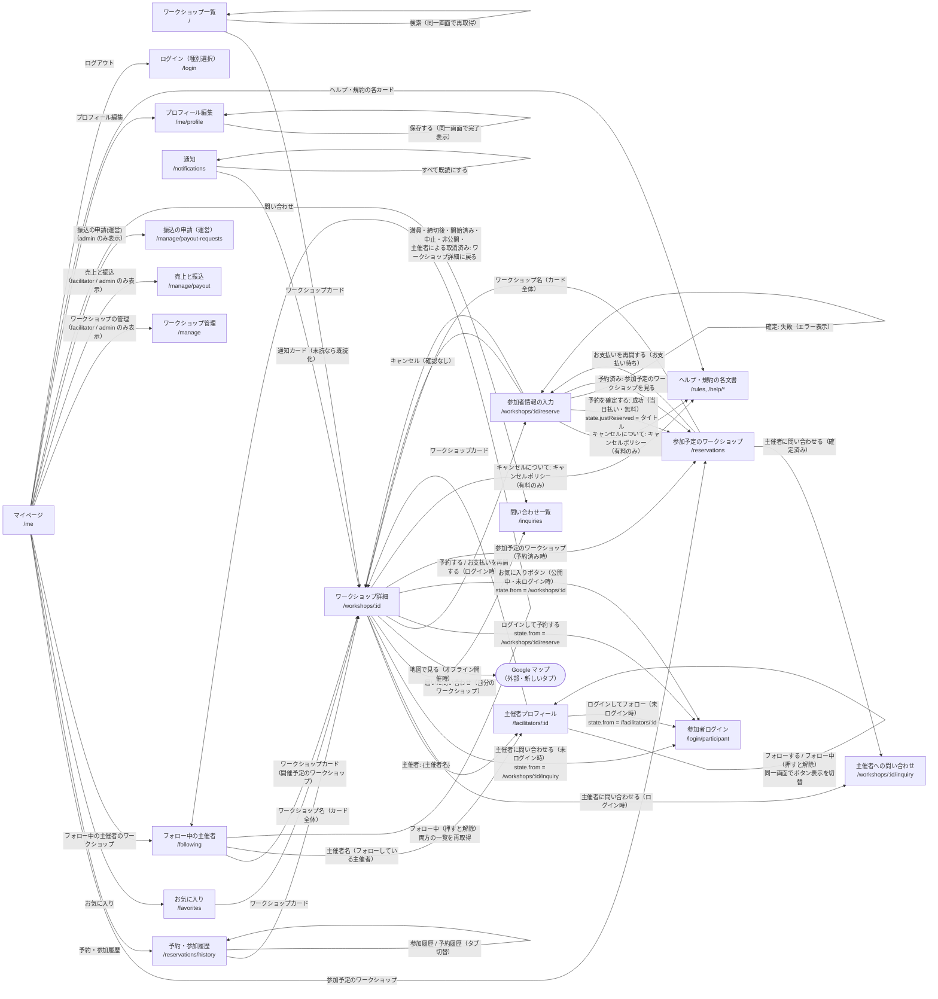
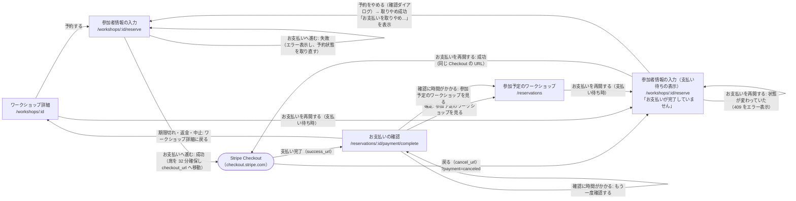
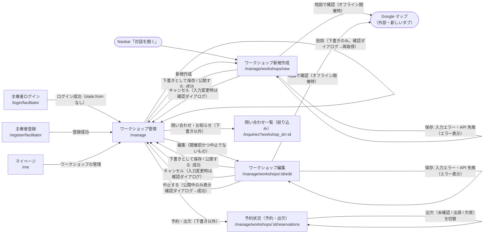
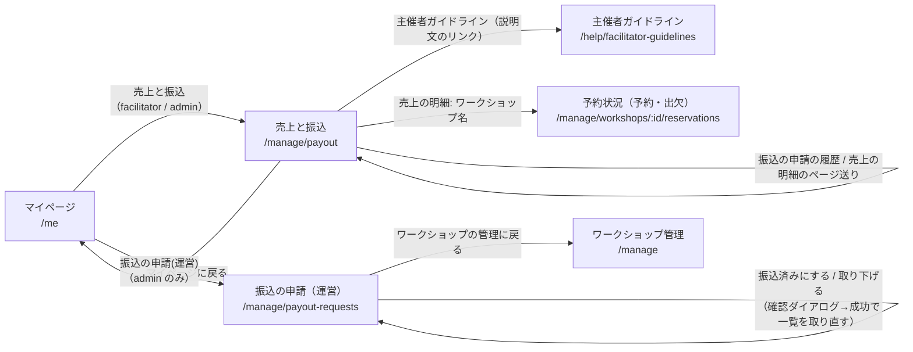

# 画面遷移図

最終更新日: 2026-10-06

> 注記（2026-10-05）: 問い合わせ（`/inquiries`、`/inquiries/:id`、`/workshops/:id/inquiry`）・ヘルプ・ガイド（`/help` 配下、`/rules`、`/about`）の画面の中での遷移は本書ではまだ詳しく描いていない（画面への入口のみ記載）。

各画面間の遷移を、きっかけ（リンク・ボタン・処理結果）とともに示す。画面数が多いため「共通ナビゲーション」「認証」「利用者向け」「オンライン決済（参加者）」「主催者向け」「売上と振込（主催者・運営）」の 6 つの図に分けている。遷移は `Link` / `navigate()` / `<Navigate>` / `window.location.assign()` のコードから読み取った。

## 1. 共通ナビゲーション（Navbar・フッター）とガード

根拠:

- Navbar のリンク: `frontend/src/components/layout/Navbar.tsx:56-115`
- フッターのリンク: `frontend/src/components/layout/Layout.tsx:13-28`
- 旧 URL `/settings`・`/settings/profile` は `/me`・`/me/profile` へ `<Navigate replace>`（`frontend/src/App.tsx:77-79`）
- 未ログイン時のリダイレクト（`state: { from: location.pathname + location.search }`）とロール不足時の `/` へのリダイレクト: `frontend/src/components/layout/ProtectedRoute.tsx:19-26`
- ログイン先の出し分け（`loginPath`）: `frontend/src/App.tsx:63, 82, 90`
- 未定義パス → `/404`: `frontend/src/App.tsx:94-95`

## 2. 認証（ログイン・新規登録）

補足:

- ログイン成功時の遷移先は `location.state.from ?? defaultRedirect` で、`replace: true` で遷移する。`defaultRedirect` は参加者ログインが `/`、主催者ログインが `/manage`（`frontend/src/components/auth/LoginForm.tsx`、`frontend/src/pages/auth/ParticipantLoginPage.tsx`、`frontend/src/pages/auth/FacilitatorLoginPage.tsx`）。
- ログインしたアカウントのロールが `allowedRoles` に含まれない場合は、即座に `logout()` してエラーメッセージを表示し、画面に留まる（`frontend/src/components/auth/LoginForm.tsx`）。
- 登録成功時は `register` → 自動で `login` し、`afterRegisterPath` へ `replace: true` で遷移する。登録後の遷移では `state.from` は参照しない（`frontend/src/context/AuthContext.tsx`、`frontend/src/components/auth/RegisterForm.tsx`）。
- 「参加者ログイン ⇔ 主催者ログイン」の切替リンクは `state={location.state}` で現在の state を引き継ぐ。このため、ログイン必須画面から参加者ログインへリダイレクトされた主催者が主催者ログインに切り替えても、ログイン後は元の画面（`state.from`）へ戻る（`frontend/src/components/auth/LoginForm.tsx`）。

## 3. 利用者向け（閲覧・予約・お気に入り・フォロー・通知・マイページ）

補足:

- 参加者は自分で予約を取り消せない。参加予定画面には「キャンセルをご希望の場合は、ワークショップの主催者にご連絡ください。」と表示し、取消ボタンはない（`frontend/src/pages/reservations/MyReservationsPage.tsx:163-181`）。取消は主催者が予約状況画面から行う（4 章）。
- 一覧・お気に入り・主催者プロフィール画面のお気に入りボタン（`FavoriteButton`）も、未ログイン時は `/login/participant`（`state.from = /workshops/:id`）へ遷移する（`frontend/src/components/workshop/FavoriteButton.tsx`）。
- ワークショップ詳細の予約ボタンは公開中（`status === 'published'`）のときのみ表示され、予約済み・主催者による取消済みのときはボタンを出さずに案内文を出す。満員・締切後・開始済みのときは無効化される。オンライン決済の支払い待ち（`viewer.is_payment_pending`）なら「お支払いを再開する」になる（`frontend/src/pages/workshops/WorkshopDetailPage.tsx:34-47, 229-264`）。
- 有料のワークショップでは、詳細画面と予約フォームの「キャンセルについて」（本サービス共通のキャンセルポリシーの要約）に、キャンセルポリシー（`/help/cancellation-policy`）へのリンクがある。同じタブで遷移する（`frontend/src/components/workshop/CancellationPolicy.tsx`）。
- 予約できるかの判定は `getReservationBlocker()`（判定の順: 非公開 → 予約済み → 主催者による取消 → 開始済み → 締切後 → 満員。支払い待ちの本人は満員でも予約可能扱い）を詳細と予約フォームで共通に使う（`frontend/src/utils/workshop.ts:67-88`）。
- 予約確定後（当日払い・無料）、参加予定画面の上部に「「{タイトル}」への参加登録が完了しました。」を表示する（`frontend/src/pages/reservations/ReservationFormPage.tsx:88-95`、`frontend/src/pages/reservations/MyReservationsPage.tsx:163-177`）。
- 詳細画面・予約画面・主催者プロフィール画面・決済完了画面は、URL の `:id` が正の整数でない場合、API を呼ばずにエラーメッセージを表示する（`parseIdParam`。`frontend/src/utils/params.ts`）。`/404` へは遷移しない。
- 中止されたワークショップの詳細は、そのワークショップを予約したことのあるユーザーも閲覧できる（`backend/app/services/workshops.py:414-428`）。
- 主催者プロフィールのフォローボタン（`FollowButton`）は、表示中の主催者の role が `facilitator` のときだけ表示する。admin（運営）のページと自分自身のページでは表示しない（`frontend/src/components/facilitator/FollowButton.tsx`、`frontend/src/utils/user.ts`）。
- フォロー中の主催者画面でフォローを解除すると、ワークショップ・主催者の両一覧を再取得する（`frontend/src/pages/me/FollowingPage.tsx`）。
- マイページのメニューのリンクには `useBackState('マイページ')` の state を付ける（`frontend/src/pages/me/MyPage.tsx:16-25`）。

## 4. オンライン決済（参加者）

オンライン決済（`payment_method = 'online'` かつ有料）のワークショップを予約するときの遷移。Stripe の画面はアプリ外。

補足:

- 予約の送信（`POST /api/workshops/{id}/reservations`）の応答に `checkout_url` があれば、Stripe のページ（`https` かつホストが `checkout.stripe.com`）であることを確かめてから `window.location.assign()` で移動する。なければ（当日払い・無料）`/reservations` へ遷移する（`frontend/src/api/reservations.ts:17-27`、`frontend/src/utils/payment.ts:32-45`、`frontend/src/pages/reservations/ReservationFormPage.tsx:65-98`）。
- Checkout の戻り先はバックエンドが決める: `success_url = {FRONTEND_BASE_URL}/reservations/{予約ID}/payment/complete`、`cancel_url = {FRONTEND_BASE_URL}/workshops/{ワークショップID}/reserve?payment=canceled`（`backend/app/services/payments.py:98-99`）。Checkout は運営の Stripe アカウント上に作成する（主催者ごとの連結アカウントは使わない）。
- 予約フォームは、閲覧者が支払い待ち（`viewer.is_payment_pending`）で他に予約を妨げる理由がなければ、入力欄の代わりに「お支払いが完了していません」のパネル（`PendingPaymentPanel`）を表示する。`?payment=canceled` のときは「お支払いの画面から戻りました。」を添える（`frontend/src/pages/reservations/ReservationFormPage.tsx:100-162, 230-241`）。
- 「お支払いを再開する」は予約 API をもう一度呼ぶ。支払い待ちのまま呼ぶと、バックエンドは同じ支払いの Checkout URL を返す。Checkout がもう開いていない（支払い済み・期限切れ）ときは状態を反映したうえで 409「お支払いの状態が変わりました。参加予定のワークショップでご確認ください」を返す（`backend/app/services/reservations.py:168-175, 323-337`）。
- 「予約をやめる」は自分の予約一覧から支払い待ちの予約を探して `POST /api/reservations/{id}/abandon-payment` を呼ぶ。見つからなければ（期限切れ・支払い済み）何もせずに画面を取り直す（`frontend/src/pages/reservations/ReservationFormPage.tsx:119-134`）。
- ブラウザの「戻る」で Stripe から予約フォームがそのまま復元された（`pageshow` の `persisted`）ときは、ボタンを押せる状態に戻して予約状態を取り直す（`frontend/src/pages/reservations/ReservationFormPage.tsx:76-86`）。
- 決済完了画面は `GET /api/reservations/{id}` を最大 10 回、2 秒間隔で取り直して予約の確定を待つ（バックエンドは支払い待ちなら Stripe から状態を読み直してから返す）。表示は次の 6 種類（`frontend/src/pages/reservations/PaymentCompletePage.tsx:12-43`、`backend/app/routers/reservations.py:40-51`）。

| 状態 | 条件 | メッセージ（要旨） | 遷移の導線 |
|---|---|---|---|
| 確認中 | 予約が `pending_payment`（10 回未満） | お支払いを確認しています。このままお待ちください。 | なし（自動で再確認） |
| 時間がかかっている | 10 回確認しても `pending_payment` | 確認が済むと、参加予定のワークショップに表示されます。 | 「参加予定のワークショップを見る」「もう一度確認する」 |
| 確定 | `confirmed` かつワークショップが中止でない | お支払いが完了し、「{タイトル}」への参加が確定しました。 | 「参加予定のワークショップを見る」 |
| 中止 | `confirmed` かつワークショップが中止 | お支払いは完了しましたが中止になりました。全額返金します。 | 「ワークショップ詳細に戻る」 |
| 返金 | それ以外で支払いが返金対象 | 満席などの理由で参加を確定できませんでした。全額返金します。 | 「ワークショップ詳細に戻る」 |
| 期限切れ | それ以外 | お支払いの期限が過ぎたため、予約は確定していません。 | 「ワークショップ詳細に戻る」 |

## 5. 主催者向け（ワークショップ管理）

補足:

- 「中止する」は編集画面の下部に表示される。実体は `POST /api/workshops/{id}/cancel`。確認文言は「このワークショップを中止にしますか?予約済みの参加者には中止のお知らせが自動で届きます。」で、オンライン決済のワークショップでは「オンラインで支払われた参加費は全額を返金します。その参加費は主催者の売上になりませんが、手数料の負担もありません。」（`FULL_REFUND_FEE_NOTE`）を追記する。フォームで編集中の内容は保存しない（`frontend/src/pages/manage/WorkshopFormPage.tsx:158-178`、`frontend/src/utils/payment.ts:30`）。
- 「削除」は下書きの行にのみ表示する。一度公開したもの（公開中・中止）は記録として残すため削除できない（`frontend/src/pages/manage/ManageWorkshopsPage.tsx:172-183`、`backend/app/routers/workshops.py:175-197`）。
- 支払方法の「オンライン決済(カード)」は、運営側でオンライン決済が有効（`GET /api/facilitators/me/payouts/summary` の `online_payment_available = true`）なときだけ選べる。主催者ごとの受け取り設定はなく、作成・編集画面から売上と振込の画面へのリンクもない。選べないときは「現在、オンライン決済はご利用いただけません。」を表示する（`frontend/src/pages/manage/WorkshopFormFields.tsx:48-133`）。
- 予約状況画面の取消フォーム（`CancelReservationForm`）は、理由（主催者の都合 / 参加者からの申し出）を選ぶとオンライン決済の返金額を事前に表示し、「キャンセルを確定する」で `POST /api/workshops/{id}/reservations/{rid}/cancel` を送る。成功すると行を差し替えて「{名前}さんの参加をキャンセルしました。」を表示する（`frontend/src/pages/manage/WorkshopReservationsPage.tsx:93-117`、`frontend/src/pages/manage/CancelReservationForm.tsx`）。
- 予約状況画面にはページ間を移動するリンクはなく、戻る導線は Navbar またはブラウザバックのみ。

## 6. 売上と振込（主催者・運営）

主催者が売上を確かめて振込を申請し、運営（admin）が銀行で振り込んだ結果を記録する流れ。アプリ外への移動はない（振込は運営が銀行で手動で行う）。

補足:

- 売上と振込の画面は、表示時に `GET /api/facilitators/me/payouts/summary`（売上の状況）、`/bank-account`（振込先口座）、`/requests`（申請の履歴。5 件ずつ）、`/earnings`（売上の明細。10 件ずつ）を取得する（`frontend/src/pages/manage/PayoutSettingsPage.tsx:32-87, 170-261`、`frontend/src/api/payouts.ts`）。
- 口座を保存すると、口座の表示を差し替えて売上の状況を取り直す（申請できるかが変わるため）。振込を申請すると、売上の状況と申請の履歴（1 ページ目）を取り直す（`frontend/src/pages/manage/PayoutSettingsPage.tsx:38-46`）。
- 「振込を申請する」は、口座が未登録・申請中のものがある・申請できる額が最低額未満のときは無効で、その理由をボタンの下に表示する（最終的な判定はバックエンドの 409）（`frontend/src/pages/manage/PayoutSettingsPage.tsx:24-30`、`backend/app/services/payouts.py:105-113`）。
- 振込の申請の画面（運営）は admin だけが開ける（`ProtectedRoute roles={['admin']}`。`frontend/src/App.tsx:90-92`）。facilitator が URL を直接開くと `/` へ、未ログインなら `/login/facilitator` へリダイレクトする。初期表示は「振込待ち」（`status=requested`）で、申請の古い順に 20 件ずつ表示する（`frontend/src/pages/manage/AdminPayoutRequestsPage.tsx:15-45`、`backend/app/services/payouts.py:245-250`）。
- 「振込済みにする」「取り下げる」は確認ダイアログの後に `POST /api/admin/payout-requests/{id}/paid`（または `/reject`）をメモとともに送る。処理して件数が減り今のページがなくなったら最後のページへ移る（`frontend/src/pages/manage/AdminPayoutRequestsPage.tsx:44-69`）。

---

参照したファイル:
- `frontend/src/App.tsx`
- `frontend/src/components/layout/Navbar.tsx`
- `frontend/src/components/layout/Layout.tsx`
- `frontend/src/components/layout/ProtectedRoute.tsx`
- `frontend/src/components/workshop/FavoriteButton.tsx`
- `frontend/src/components/workshop/CancellationPolicy.tsx`
- `frontend/src/components/facilitator/FollowButton.tsx`
- `frontend/src/components/auth/LoginForm.tsx`
- `frontend/src/components/auth/RegisterForm.tsx`
- `frontend/src/context/AuthContext.tsx`
- `frontend/src/pages/workshops/WorkshopDetailPage.tsx`
- `frontend/src/pages/reservations/ReservationFormPage.tsx`
- `frontend/src/pages/reservations/MyReservationsPage.tsx`
- `frontend/src/pages/reservations/PaymentCompletePage.tsx`
- `frontend/src/pages/me/MyPage.tsx`
- `frontend/src/pages/me/FollowingPage.tsx`
- `frontend/src/pages/manage/ManageWorkshopsPage.tsx`
- `frontend/src/pages/manage/WorkshopFormPage.tsx`
- `frontend/src/pages/manage/WorkshopFormFields.tsx`
- `frontend/src/pages/manage/WorkshopReservationsPage.tsx`
- `frontend/src/pages/manage/CancelReservationForm.tsx`
- `frontend/src/pages/manage/PayoutSettingsPage.tsx`
- `frontend/src/pages/manage/BankAccountForm.tsx`
- `frontend/src/pages/manage/AdminPayoutRequestsPage.tsx`
- `frontend/src/api/reservations.ts`
- `frontend/src/api/payouts.ts`
- `frontend/src/utils/payment.ts`
- `frontend/src/utils/workshop.ts`
- `frontend/src/utils/user.ts`
- `frontend/src/utils/params.ts`
- `frontend/src/pages/auth/*.tsx`
- `backend/app/services/payments.py`
- `backend/app/services/reservations.py`
- `backend/app/services/workshops.py`
- `backend/app/services/payouts.py`
- `backend/app/routers/reservations.py`
- `backend/app/routers/workshops.py`
