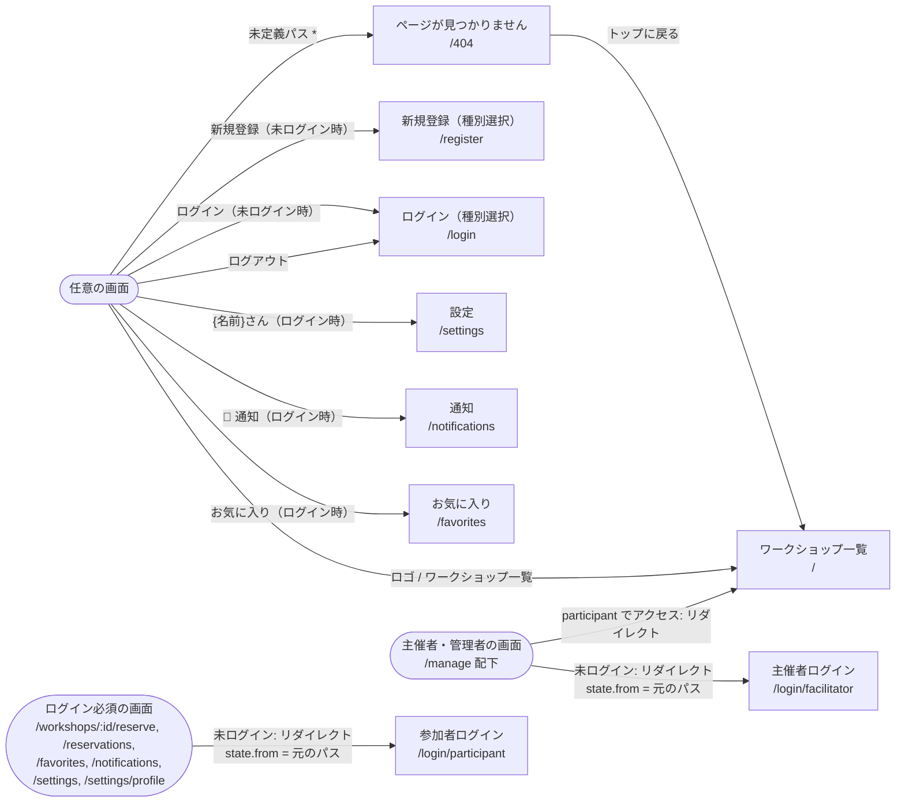
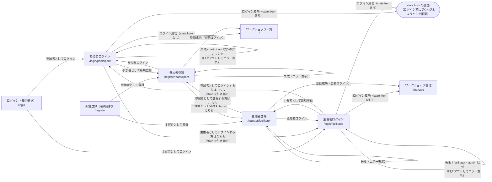
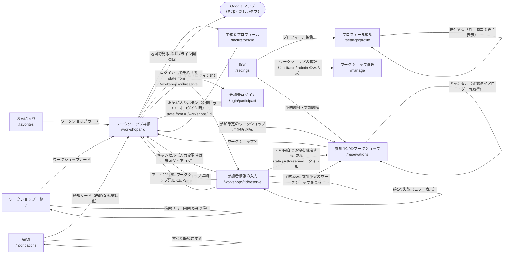
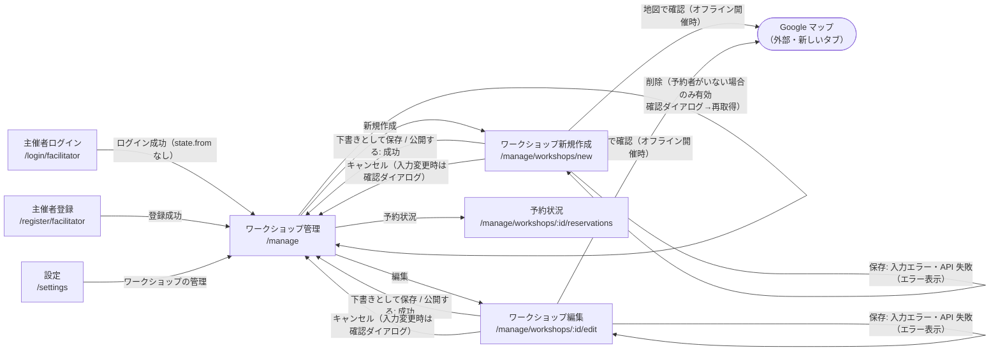

# 画面遷移図

最終更新日: 2026-09-25

各画面間の遷移を、きっかけ（リンク・ボタン・処理結果）とともに示す。画面数が多いため「共通ナビゲーション」「認証」「利用者向け」「主催者向け」の 4 つの図に分けている。遷移は `Link` / `navigate()` / `<Navigate>` のコードから読み取った。

## 1. 共通ナビゲーション（Navbar）とガード

根拠:

- Navbar のリンクとログアウト後の `navigate('/login')`: `frontend/src/components/Navbar.tsx:10-13, 18-75`
- 未ログイン時のリダイレクト（`state: { from: location.pathname }`）とロール不足時の `/` へのリダイレクト: `frontend/src/components/ProtectedRoute.tsx:18-24`
- ログイン先の出し分け（`loginPath`）: `frontend/src/App.tsx:39, 48`
- 未定義パス → `/404`: `frontend/src/App.tsx:55-56`

## 2. 認証（ログイン・新規登録）

補足:

- ログイン成功時の遷移先は `location.state.from ?? defaultRedirect` で、`replace: true` で遷移する（`frontend/src/components/auth/LoginForm.tsx:55-56`）。`defaultRedirect` は参加者ログインが `/`、主催者ログインが `/manage`（`frontend/src/pages/auth/ParticipantLoginPage.tsx:11`、`frontend/src/pages/auth/FacilitatorLoginPage.tsx:11`）。
- ログインしたアカウントのロールが `allowedRoles` に含まれない場合は、即座に `logout()` してエラーメッセージを表示し、画面に留まる（`frontend/src/components/auth/LoginForm.tsx:50-54`）。
- 登録成功時は `register` → 自動で `login` し、`afterRegisterPath` へ `replace: true` で遷移する。登録後の遷移では `state.from` は参照しない（`frontend/src/context/AuthContext.tsx:53-56`、`frontend/src/components/auth/RegisterForm.tsx:44-45`）。
- 「参加者ログイン ⇔ 主催者ログイン」の切替リンクは `state={location.state}` で現在の state を引き継ぐ。このため、ログイン必須画面から参加者ログインへリダイレクトされた主催者が主催者ログインに切り替えても、ログイン後は元の画面（`state.from`）へ戻る（`frontend/src/components/auth/LoginForm.tsx:109-112`）。

## 3. 利用者向け（閲覧・予約・お気に入り・通知・設定）

補足:

- 一覧・お気に入り・主催者プロフィール画面のお気に入りボタン（`FavoriteButton`）も、未ログイン時は `/login/participant`（`state.from = /workshops/:id`）へ遷移する。カード自体のリンク遷移は `preventDefault` / `stopPropagation` で抑止される（`frontend/src/components/FavoriteButton.tsx:21-28`）。
- ワークショップ詳細の予約ボタンは、公開中（`status === 'published'`）のときのみ表示され、満員または予約済みのときは無効化される（`frontend/src/pages/WorkshopDetailPage.tsx:157-171`）。
- 予約確定後、参加予定画面の上部に「「{タイトル}」への参加登録が完了しました。」を表示する（`frontend/src/pages/ReservationFormPage.tsx:78`、`frontend/src/pages/MyReservationsPage.tsx:16, 63-67`）。
- 詳細画面・予約画面・主催者プロフィール画面は、URL の `:id` が正の整数でない場合、API を呼ばずにエラーメッセージを表示する（`parseIdParam`。`frontend/src/pages/WorkshopDetailPage.tsx:28-33`、`frontend/src/pages/ReservationFormPage.tsx:28-33`、`frontend/src/pages/FacilitatorProfilePage.tsx:18-23`、`frontend/src/utils/params.ts`）。`/404` へは遷移しない。
- 中止されたワークショップの詳細は、そのワークショップを予約したことのあるユーザーも閲覧できる。このため、通知一覧（中止のお知らせ）や参加予定一覧からのリンクで、中止のバナー付きの詳細画面を表示できる（`backend/app/routers/workshops.py:102-110`、`frontend/src/pages/WorkshopDetailPage.tsx:88-92`）。
- 詳細画面のお気に入りボタンは公開中のときのみ表示される（`frontend/src/pages/WorkshopDetailPage.tsx:95-97`）。

## 4. 主催者向け（ワークショップ管理）

補足:

- 「中止する」は開催予定タブかつ `status !== 'canceled'` の行にのみ表示される。実体は `PUT /api/workshops/{id}` で `status: 'canceled'` を送る処理（`frontend/src/pages/manage/ManageWorkshopsPage.tsx:54-73, 156-163`）。
- 保存時は、ワークショップ本体の保存（作成 / 更新）が成功した後に、画像の差し替え（`POST /image`）または削除（`DELETE /image`）を行ってから `/manage` へ遷移する（`frontend/src/pages/manage/WorkshopFormPage.tsx:146-162`）。
- 予約状況画面にはリンク・ボタンがなく、戻る導線は Navbar またはブラウザバックのみ（`frontend/src/pages/manage/WorkshopReservationsPage.tsx`）。

---

参照したファイル:
- `frontend/src/App.tsx`
- `frontend/src/components/Navbar.tsx`
- `frontend/src/components/ProtectedRoute.tsx`
- `frontend/src/components/FavoriteButton.tsx`
- `frontend/src/components/WorkshopCard.tsx`
- `frontend/src/components/auth/LoginForm.tsx`
- `frontend/src/components/auth/RegisterForm.tsx`
- `frontend/src/context/AuthContext.tsx`
- `frontend/src/pages/WorkshopListPage.tsx`
- `frontend/src/pages/WorkshopDetailPage.tsx`
- `frontend/src/pages/ReservationFormPage.tsx`
- `frontend/src/pages/MyReservationsPage.tsx`
- `frontend/src/pages/FavoritesPage.tsx`
- `frontend/src/pages/NotificationsPage.tsx`
- `frontend/src/pages/SettingsPage.tsx`
- `frontend/src/pages/FacilitatorProfilePage.tsx`
- `frontend/src/pages/NotFoundPage.tsx`
- `frontend/src/pages/auth/*.tsx`
- `frontend/src/pages/manage/*.tsx`
- `frontend/src/utils/params.ts`
