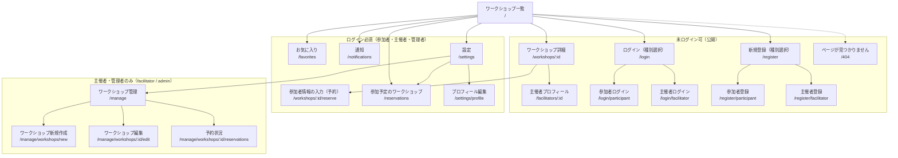

# サイトマップ

最終更新日: 2026-09-28

Workshop App（React SPA）の全画面と URL パス、アクセス権限を階層で示す。ルート定義は `frontend/src/App.tsx` のもの。すべての画面は共通レイアウト `Layout`（`Navbar` + メイン領域）の中に表示される。

## サイトマップ図

凡例:

- 実線: 画面の階層（親画面から辿れる子画面）
- 点線: 未定義パス（`*`）は `/404` へリダイレクト（`frontend/src/App.tsx:56`）
- subgraph: アクセス権限の区分（下表参照）

### 権限区分

| 区分 | 判定方法 | 未ログイン時の扱い | 権限不足時の扱い |
|---|---|---|---|
| 未ログイン可 | ガードなし | そのまま表示 | — |
| ログイン必須 | `<ProtectedRoute loginPath="/login/participant" />`（ロール指定なし） | `/login/participant` へリダイレクト（`state.from` に元のパス） | — |
| 主催者・管理者のみ | `<ProtectedRoute roles={['admin','facilitator']} loginPath="/login/facilitator" />` | `/login/facilitator` へリダイレクト（`state.from` に元のパス） | `/` へリダイレクト |

根拠: `frontend/src/App.tsx:39-53`、`frontend/src/components/ProtectedRoute.tsx:14-24`

- 認証状態の確認中（`loading`）は「読み込み中...」を表示する（`frontend/src/components/ProtectedRoute.tsx:14-16`）。
- 「ログイン必須」区分はロールを問わないため、参加者だけでなく主催者・管理者も利用できる。

## 画面一覧表

| No | 画面名 | パス | 権限 | 対応コンポーネントファイル |
|---|---|---|---|---|
| 1 | ワークショップ一覧（トップ） | `/` | 未ログイン可 | `frontend/src/pages/WorkshopListPage.tsx` |
| 2 | ワークショップ詳細 | `/workshops/:id` | 未ログイン可 | `frontend/src/pages/WorkshopDetailPage.tsx` |
| 3 | 主催者プロフィール | `/facilitators/:id` | 未ログイン可 | `frontend/src/pages/FacilitatorProfilePage.tsx` |
| 4 | ログイン（種別選択） | `/login` | 未ログイン可 | `frontend/src/pages/auth/LoginChooserPage.tsx` |
| 5 | 参加者ログイン | `/login/participant` | 未ログイン可 | `frontend/src/pages/auth/ParticipantLoginPage.tsx`（`components/auth/LoginForm.tsx`） |
| 6 | 主催者ログイン | `/login/facilitator` | 未ログイン可 | `frontend/src/pages/auth/FacilitatorLoginPage.tsx`（`components/auth/LoginForm.tsx`） |
| 7 | 新規登録（種別選択） | `/register` | 未ログイン可 | `frontend/src/pages/auth/RegisterChooserPage.tsx` |
| 8 | 参加者登録 | `/register/participant` | 未ログイン可 | `frontend/src/pages/auth/ParticipantRegisterPage.tsx`（`components/auth/RegisterForm.tsx`） |
| 9 | 主催者登録 | `/register/facilitator` | 未ログイン可 | `frontend/src/pages/auth/FacilitatorRegisterPage.tsx`（`components/auth/RegisterForm.tsx`） |
| 10 | 参加者情報の入力（予約） | `/workshops/:id/reserve` | ログイン必須 | `frontend/src/pages/ReservationFormPage.tsx` |
| 11 | 参加予定のワークショップ | `/reservations` | ログイン必須 | `frontend/src/pages/MyReservationsPage.tsx` |
| 12 | お気に入り | `/favorites` | ログイン必須 | `frontend/src/pages/FavoritesPage.tsx` |
| 13 | 通知 | `/notifications` | ログイン必須 | `frontend/src/pages/NotificationsPage.tsx` |
| 14 | 設定 | `/settings` | ログイン必須 | `frontend/src/pages/SettingsPage.tsx` |
| 15 | プロフィール編集 | `/settings/profile` | ログイン必須 | `frontend/src/pages/manage/ProfileEditPage.tsx` |
| 16 | ワークショップ管理 | `/manage` | 主催者・管理者 | `frontend/src/pages/manage/ManageWorkshopsPage.tsx` |
| 17 | ワークショップ新規作成 | `/manage/workshops/new` | 主催者・管理者 | `frontend/src/pages/manage/WorkshopFormPage.tsx` |
| 18 | ワークショップ編集 | `/manage/workshops/:id/edit` | 主催者・管理者 | `frontend/src/pages/manage/WorkshopFormPage.tsx`（新規作成と共用） |
| 19 | 予約状況 | `/manage/workshops/:id/reservations` | 主催者・管理者 | `frontend/src/pages/manage/WorkshopReservationsPage.tsx` |
| 20 | ページが見つかりません | `/404`（未定義パス `*` もここへ） | 未ログイン可 | `frontend/src/pages/NotFoundPage.tsx` |

補足:

- プロフィール編集画面のコンポーネントは `pages/manage/` 配下にあるが、ルートは「ログイン必須」区分に属し参加者も利用できる（`frontend/src/App.tsx:45`）。
- 画面 17・18 は同一コンポーネントで、URL の `:id` 有無で新規作成 / 編集を切り替える（`frontend/src/pages/manage/WorkshopFormPage.tsx:38-39`）。

## ナビゲーションバー（Navbar）からの導線

| 表示条件 | リンク / ボタン | 遷移先 |
|---|---|---|
| 常時 | 「Workshop App」（ロゴ） | `/` |
| 常時 | 「ワークショップ一覧」 | `/` |
| ログイン時 | 通知アイコン（未読件数バッジ付き） | `/notifications` |
| ログイン時 | プロフィールアイコン | `/settings` |
| 未ログイン時 | 「ログイン」 | `/login` |
| 未ログイン時 | 「新規登録」 | `/register` |

根拠: `frontend/src/components/Navbar.tsx:18-75`

- `/manage`（ワークショップ管理）、`/reservations`（参加予定）、`/favorites`（お気に入り）へは Navbar に直接リンクはなく、設定画面（`/settings`）のメニューから遷移する（`frontend/src/pages/SettingsPage.tsx`）。

---

参照したファイル:
- `frontend/src/App.tsx`
- `frontend/src/main.tsx`
- `frontend/src/components/ProtectedRoute.tsx`
- `frontend/src/components/Navbar.tsx`
- `frontend/src/components/Layout.tsx`
- `frontend/src/pages/SettingsPage.tsx`
- `frontend/src/pages/manage/WorkshopFormPage.tsx`
- `frontend/src/pages/auth/*.tsx`
- `frontend/src/components/auth/LoginForm.tsx`
- `frontend/src/components/auth/RegisterForm.tsx`
