# サイトマップ

最終更新日: 2026-10-05

TAIWA（React SPA）の全画面と URL パス、アクセス権限を階層で示す。ルート定義は `frontend/src/App.tsx` のもの。すべての画面は共通レイアウト `Layout`（`Navbar` + メイン領域。`frontend/src/components/layout/Layout.tsx`）の中に表示される。

## サイトマップ図

```mermaid
flowchart TD
    TOP["ワークショップ一覧（さがす）<br/>/"]

    subgraph PUBLIC["未ログイン可（公開）"]
        DETAIL["ワークショップ詳細<br/>/workshops/:id"]
        FACI["主催者プロフィール<br/>/facilitators/:id"]
        LOGIN["ログイン（種別選択）<br/>/login"]
        LOGIN_P["参加者ログイン<br/>/login/participant"]
        LOGIN_F["主催者ログイン<br/>/login/facilitator"]
        REG["新規登録（種別選択）<br/>/register"]
        REG_P["参加者登録<br/>/register/participant"]
        REG_F["主催者登録<br/>/register/facilitator"]
        ABOUT["TAIWA について<br/>/about"]
        RULES["対話のルール<br/>/rules"]
        HELP["ヘルプ・規約<br/>/help"]
        TERMS["利用規約<br/>/help/terms"]
        CPOL["キャンセルポリシー<br/>/help/cancellation-policy"]
        FGL["主催者ガイドライン<br/>/help/facilitator-guidelines"]
        TOKU["特定商取引法に基づく表記<br/>/help/tokushoho"]
        NOTFOUND["ページが見つかりません<br/>/404"]
    end

    subgraph AUTHED["ログイン必須（参加者・主催者・管理者）"]
        RESERVE["参加者情報の入力（予約）<br/>/workshops/:id/reserve"]
        PAYDONE["お支払いの確認（決済完了）<br/>/reservations/:id/payment/complete"]
        MYRSV["参加予定のワークショップ<br/>/reservations"]
        HIST["予約・参加履歴<br/>/reservations/history"]
        FAV["お気に入り<br/>/favorites"]
        FOLLOWING["フォロー中の主催者<br/>/following"]
        NOTI["通知<br/>/notifications"]
        WSINQ["主催者への問い合わせ<br/>/workshops/:id/inquiry"]
        INQ["問い合わせ一覧<br/>/inquiries"]
        INQT["問い合わせのやり取り<br/>/inquiries/:id"]
        MYPAGE["マイページ<br/>/me（旧 /settings はリダイレクト）"]
        PROFILE["プロフィール編集<br/>/me/profile（旧 /settings/profile はリダイレクト）"]
    end

    subgraph MANAGER["主催者・管理者のみ（facilitator / admin）"]
        MANAGE["ワークショップ管理<br/>/manage"]
        WS_NEW["ワークショップ新規作成<br/>/manage/workshops/new"]
        WS_EDIT["ワークショップ編集<br/>/manage/workshops/:id/edit"]
        WS_RSV["予約状況（予約・出欠）<br/>/manage/workshops/:id/reservations"]
        PAYOUT["参加費の受け取り設定<br/>/manage/payout"]
    end

    STRIPE(["Stripe（外部）<br/>Checkout / Connect"])

    TOP --> DETAIL
    DETAIL --> RESERVE
    RESERVE -.->|"オンライン決済"| STRIPE
    STRIPE -.->|"支払い完了後に戻る"| PAYDONE
    DETAIL --> FACI
    DETAIL --> WSINQ
    TOP --> LOGIN
    LOGIN --> LOGIN_P
    LOGIN --> LOGIN_F
    TOP --> REG
    REG --> REG_P
    REG --> REG_F
    TOP --> RULES
    TOP --> INQ
    INQ --> INQT
    TOP --> NOTI
    TOP --> MYPAGE
    MYPAGE --> MYRSV
    MYPAGE --> HIST
    MYPAGE --> FAV
    MYPAGE --> FOLLOWING
    FOLLOWING --> FACI
    MYPAGE --> MANAGE
    MYPAGE --> PAYOUT
    MYPAGE --> INQ
    MYPAGE --> PROFILE
    MYPAGE -->|"ヘルプ・規約の各文書"| TERMS
    TOP -->|"フッター"| ABOUT
    TOP -->|"フッター"| HELP
    HELP --> TERMS
    HELP --> CPOL
    DETAIL -->|"キャンセルについて（有料のみ）"| CPOL
    HELP --> FGL
    HELP --> TOKU
    TOP --> WS_NEW
    MANAGE --> WS_NEW
    MANAGE --> WS_EDIT
    MANAGE --> WS_RSV
    WS_EDIT --> PAYOUT
    PAYOUT -.->|"受け取り設定・売上の確認"| STRIPE
    TOP -.-> NOTFOUND
```

凡例:

- 実線: 画面の階層（親画面から辿れる子画面）
- 点線（`STRIPE`）: アプリ外の Stripe の画面への移動と、そこからの戻り
- 点線（`/404`）: 未定義パス（`*`）は `/404` へリダイレクト（`frontend/src/App.tsx:89-90`）
- subgraph: アクセス権限の区分（下表参照）
- 「フッター」: 共通レイアウトのフッターに「TAIWA について」（`/about`）「対話のルール」（`/rules`）「ヘルプ・規約」（`/help`）のリンクがある（`frontend/src/components/layout/Layout.tsx:13-28`）。マイページからはヘルプ・規約の各文書（`/rules`、`/help/*`）へ直接リンクする（図では代表して利用規約への矢印のみ描く）
- 「キャンセルについて」: 有料のワークショップの詳細と予約フォームには、本サービス共通のキャンセルポリシーの要約と `/help/cancellation-policy` へのリンクがある（ワークショップごとのキャンセルポリシーはない。`frontend/src/components/workshop/CancellationPolicy.tsx`）。図では代表して詳細からの矢印のみ描く

### 権限区分

| 区分 | 判定方法 | 未ログイン時の扱い | 権限不足時の扱い |
|---|---|---|---|
| 未ログイン可 | ガードなし | そのまま表示 | — |
| ログイン必須 | `<ProtectedRoute loginPath="/login/participant" />`（ロール指定なし） | `/login/participant` へリダイレクト（`state.from` に元のパス + クエリ） | — |
| 主催者・管理者のみ | `<ProtectedRoute roles={['admin','facilitator']} loginPath="/login/facilitator" />` | `/login/facilitator` へリダイレクト（`state.from` に元のパス + クエリ） | `/` へリダイレクト |

根拠: `frontend/src/App.tsx:62-87`、`frontend/src/components/layout/ProtectedRoute.tsx:11-28`

- 認証状態の確認中（`loading`）は読み込み中の表示（`LoadingMessage`）を出す（`frontend/src/components/layout/ProtectedRoute.tsx:15-17`）。
- `state.from` は `location.pathname + location.search`。Stripe から `?payment=canceled` や `?returned=1` 付きで戻ったときにログインが切れていても、ログイン後に同じ URL へ戻る（`frontend/src/components/layout/ProtectedRoute.tsx:19-22`）。
- 「ログイン必須」区分はロールを問わないため、参加者だけでなく主催者・管理者も利用できる。
- ヘルプ・規約・対話のルールは、登録前にも読めるよう未ログインで表示する（`frontend/src/App.tsx:53-60`）。

## 画面一覧表

| No | 画面名 | パス | 権限 | 対応コンポーネントファイル |
|---|---|---|---|---|
| 1 | ワークショップ一覧（トップ） | `/` | 未ログイン可 | `frontend/src/pages/workshops/WorkshopListPage.tsx` |
| 2 | ワークショップ詳細 | `/workshops/:id` | 未ログイン可 | `frontend/src/pages/workshops/WorkshopDetailPage.tsx` |
| 3 | 主催者プロフィール | `/facilitators/:id` | 未ログイン可 | `frontend/src/pages/workshops/FacilitatorProfilePage.tsx` |
| 4 | ログイン（種別選択） | `/login` | 未ログイン可 | `frontend/src/pages/auth/LoginChooserPage.tsx` |
| 5 | 参加者ログイン | `/login/participant` | 未ログイン可 | `frontend/src/pages/auth/ParticipantLoginPage.tsx`（`components/auth/LoginForm.tsx`） |
| 6 | 主催者ログイン | `/login/facilitator` | 未ログイン可 | `frontend/src/pages/auth/FacilitatorLoginPage.tsx`（`components/auth/LoginForm.tsx`） |
| 7 | 新規登録（種別選択） | `/register` | 未ログイン可 | `frontend/src/pages/auth/RegisterChooserPage.tsx` |
| 8 | 参加者登録 | `/register/participant` | 未ログイン可 | `frontend/src/pages/auth/ParticipantRegisterPage.tsx`（`components/auth/RegisterForm.tsx`） |
| 9 | 主催者登録 | `/register/facilitator` | 未ログイン可 | `frontend/src/pages/auth/FacilitatorRegisterPage.tsx`（`components/auth/RegisterForm.tsx`） |
| 10 | 参加者情報の入力（予約） | `/workshops/:id/reserve` | ログイン必須 | `frontend/src/pages/reservations/ReservationFormPage.tsx` |
| 11 | 参加予定のワークショップ | `/reservations` | ログイン必須 | `frontend/src/pages/reservations/MyReservationsPage.tsx`（`MyReservationsPage`） |
| 12 | お気に入り | `/favorites` | ログイン必須 | `frontend/src/pages/me/FavoritesPage.tsx` |
| 13 | 通知 | `/notifications` | ログイン必須 | `frontend/src/pages/me/NotificationsPage.tsx` |
| 14 | マイページ | `/me`（旧 `/settings` は `/me` へリダイレクト） | ログイン必須 | `frontend/src/pages/me/MyPage.tsx` |
| 15 | プロフィール編集 | `/me/profile`（旧 `/settings/profile` は `/me/profile` へリダイレクト） | ログイン必須 | `frontend/src/pages/manage/ProfileEditPage.tsx` |
| 16 | ワークショップ管理 | `/manage` | 主催者・管理者 | `frontend/src/pages/manage/ManageWorkshopsPage.tsx` |
| 17 | ワークショップ新規作成 | `/manage/workshops/new` | 主催者・管理者 | `frontend/src/pages/manage/WorkshopFormPage.tsx`（入力欄は `WorkshopFormFields.tsx`） |
| 18 | ワークショップ編集 | `/manage/workshops/:id/edit` | 主催者・管理者 | `frontend/src/pages/manage/WorkshopFormPage.tsx`（新規作成と共用） |
| 19 | 予約状況（予約・出欠） | `/manage/workshops/:id/reservations` | 主催者・管理者 | `frontend/src/pages/manage/WorkshopReservationsPage.tsx`（取消フォームは `CancelReservationForm.tsx`） |
| 20 | ページが見つかりません | `/404`（未定義パス `*` もここへ） | 未ログイン可 | `frontend/src/pages/NotFoundPage.tsx` |
| 21 | フォロー中の主催者 | `/following` | ログイン必須 | `frontend/src/pages/me/FollowingPage.tsx` |
| 22 | 予約・参加履歴 | `/reservations/history` | ログイン必須 | `frontend/src/pages/reservations/MyReservationsPage.tsx`（`ReservationHistoryPage`） |
| 23 | お支払いの確認（決済完了） | `/reservations/:id/payment/complete` | ログイン必須 | `frontend/src/pages/reservations/PaymentCompletePage.tsx` |
| 24 | 主催者への問い合わせ | `/workshops/:id/inquiry` | ログイン必須 | `frontend/src/pages/inquiries/WorkshopInquiryPage.tsx` |
| 25 | 問い合わせ一覧 | `/inquiries` | ログイン必須 | `frontend/src/pages/inquiries/InquiriesPage.tsx` |
| 26 | 問い合わせのやり取り | `/inquiries/:id` | ログイン必須 | `frontend/src/pages/inquiries/InquiryThreadPage.tsx` |
| 27 | 参加費の受け取り設定 | `/manage/payout` | 主催者・管理者 | `frontend/src/pages/manage/PayoutSettingsPage.tsx` |
| 28 | TAIWA について | `/about` | 未ログイン可 | `frontend/src/pages/guide/AboutPage.tsx` |
| 29 | 対話のルール | `/rules` | 未ログイン可 | `frontend/src/pages/guide/DialogueRulesPage.tsx` |
| 30 | ヘルプ・規約 | `/help` | 未ログイン可 | `frontend/src/pages/help/HelpPage.tsx` |
| 31 | 利用規約 | `/help/terms` | 未ログイン可 | `frontend/src/pages/help/TermsPage.tsx` |
| 32 | キャンセルポリシー | `/help/cancellation-policy` | 未ログイン可 | `frontend/src/pages/help/CancellationPolicyPage.tsx` |
| 33 | 主催者ガイドライン | `/help/facilitator-guidelines` | 未ログイン可 | `frontend/src/pages/help/FacilitatorGuidelinesPage.tsx` |
| 34 | 特定商取引法に基づく表記 | `/help/tokushoho` | 未ログイン可 | `frontend/src/pages/help/TokushohoPage.tsx` |

補足:

- 画面 23（決済完了）は、Stripe の支払い画面で支払いを終えたあとに戻ってくる先。バックエンドの `start_checkout()` が Checkout の `success_url` にこのパスを指定している（`frontend/src/App.tsx:66-67`、`backend/app/services/payments.py:192`）。
- 画面 27（受け取り設定）のパスは定数 `PAYOUT_SETTINGS_PATH`（`frontend/src/utils/payment.ts:8`）で、バックエンドの同名定数（Stripe の受け取り設定画面の戻り先。`backend/app/services/payments.py:32`）と揃えている。
- プロフィール編集画面のコンポーネントは `pages/manage/` 配下にあるが、ルートは「ログイン必須」区分に属し参加者も利用できる（`frontend/src/App.tsx:75`）。
- 画面 17・18 は同一コンポーネントで、URL の `:id` 有無で新規作成 / 編集を切り替える。
- 画面 11・22 は同じファイルの別コンポーネント（`MyReservationsPage` / `ReservationHistoryPage`）。

## ナビゲーションバー（Navbar）からの導線

| 表示条件 | リンク / ボタン | 遷移先 |
|---|---|---|
| 常時 | 「TAIWA」（ロゴ） | `/` |
| 常時 | 「さがす」（狭い画面では検索アイコン） | `/` |
| 常時 | 「対話のルール」（狭い画面では本のアイコン） | `/rules` |
| ログイン時かつ facilitator / admin | 「対話を開く」（狭い画面では＋アイコン） | `/manage/workshops/new` |
| ログイン時 | 問い合わせアイコン（未読件数バッジ付き） | `/inquiries` |
| ログイン時 | 通知アイコン（未読件数バッジ付き） | `/notifications` |
| ログイン時 | プロフィールアイコン（「{name}さんのマイページ」） | `/me` |
| 未ログイン時 | 「ログイン」 | `/login` |
| 未ログイン時 | 「新規登録」 | `/register` |

根拠: `frontend/src/components/layout/Navbar.tsx:56-115`

- `/manage`（ワークショップ管理）、`/manage/payout`（参加費の受け取り設定）、`/reservations`（参加予定）、`/reservations/history`（予約・参加履歴）、`/favorites`（お気に入り）、`/following`（フォロー中の主催者）、`/me/profile`、ヘルプ・規約の各ページへは Navbar に直接リンクはなく、マイページ（`/me`）のメニューから遷移する（`frontend/src/pages/me/MyPage.tsx:67-129`）。

---

参照したファイル:
- `frontend/src/App.tsx`
- `frontend/src/components/layout/ProtectedRoute.tsx`
- `frontend/src/components/layout/Navbar.tsx`
- `frontend/src/components/layout/Layout.tsx`
- `frontend/src/pages/me/MyPage.tsx`
- `frontend/src/pages/me/FollowingPage.tsx`
- `frontend/src/pages/help/helpDocuments.ts`
- `frontend/src/pages/manage/WorkshopFormFields.tsx`
- `frontend/src/pages/manage/PayoutSettingsPage.tsx`
- `frontend/src/pages/reservations/PaymentCompletePage.tsx`
- `frontend/src/pages/reservations/MyReservationsPage.tsx`
- `frontend/src/utils/payment.ts`
- `frontend/src/components/workshop/CancellationPolicy.tsx`
- `backend/app/services/payments.py`
