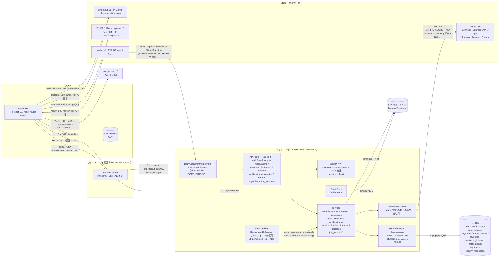

# システム構成図

最終更新日: 2026-10-05

ブラウザ上の React SPA（Vite 開発サーバー）から、Vite のプロキシ経由で FastAPI バックエンドの REST API を呼び出し、MySQL にデータを保存する構成。参加費のオンライン決済は Stripe（Connect / Checkout / Webhook）と連携する。画像はバックエンドのローカルディレクトリに保存し、リマインド通知と決済の後処理は FastAPI プロセス内の APScheduler が定期実行する。本書はコードから読み取れる開発環境の構成のみを示し、本番環境のホスティング先等は扱わない。

## 構成図

### 通信・認証の流れ

1. ログイン: SPA が `POST /api/auth/login` に `application/x-www-form-urlencoded`（`username` = メールアドレス, `password`）を送信し、`{ access_token, token_type: "bearer" }` を受け取る（`frontend/src/api/auth.ts`、`backend/app/routers/auth.py:42`）。ログイン失敗は IP とメールアドレスごとに数え、上限（`LOGIN_MAX_FAILURES` / `LOGIN_FAILURE_WINDOW_SECONDS`）を超えると 429 を返す（`backend/app/core/rate_limit.py`）。
2. トークン保存: ブラウザの `localStorage` に保存する（`frontend/src/api/client.ts`、`frontend/src/context/AuthContext.tsx`）。
3. API 呼び出し: axios のリクエストインターセプターが全リクエストに `Authorization: Bearer <token>` を付与する（`frontend/src/api/client.ts`）。Cookie は使わないため、CORS の `allow_credentials` は付けない（`backend/app/main.py:82-89`）。
4. 検証: バックエンドは `OAuth2PasswordBearer` でトークンを取り出し、PyJWT（`import jwt`）で署名（既定 HS256）と有効期限を検証、`sub`（ユーザー ID）からユーザーを取得する（`backend/app/core/deps.py`、`backend/app/core/security.py`）。
5. 401 応答時: axios のレスポンスインターセプターが `AUTH_EXPIRED_EVENT`（`workshop_app:auth_expired`）を発火し、`AuthContext` がログアウトさせる（`frontend/src/api/client.ts:28, 40`）。
6. 起動時: トークンがあれば `GET /api/auth/me` でユーザー情報を復元する（`frontend/src/context/AuthContext.tsx`）。

- JWT の有効期限は `JWT_EXPIRE_MINUTES`（既定 1440 分 = 24 時間）。リフレッシュトークンの仕組みはない。起動時に `settings.check_jwt_secret()` が JWT の秘密鍵を確かめ、初期値または 32 文字未満なら `APP_ENV` が `development` 以外では起動を止める（`backend/app/config.py:51-64`、`backend/app/main.py:58`）。
- 認可は `require_roles(UserRole.admin, UserRole.facilitator)` と、service の取得関数（`get_managed_workshop()` / `get_viewable_workshop()` など）での所有者チェックで行う（`backend/app/core/deps.py`、`backend/app/services/workshops.py:50-65, 419-433`）。
- 日時は API の応答では UTC のタイムゾーン付き（`Z` 付き）で返し、入力はタイムゾーンなしの UTC に変換してから DB に保存する（`backend/app/schemas/types.py`）。
- 一覧 API の総件数は `X-Total-Count` ヘッダーで返し、CORS の `expose_headers` で公開している（`backend/app/main.py:83-89`）。
- リクエスト本文の大きさは `BodySizeLimitMiddleware` が受け取り中に制限し、超えたら 413 を返す（`backend/app/main.py:79-81`）。

### データベースの接続とトランザクション

- 接続 URL は `mysql+pymysql://...`（`DB_*` から組み立て。`backend/app/config.py:91-94`）。
- 隔離レベルは `READ COMMITTED` に固定している。定員・状態が関わる処理は `lock_workshop()`（`SELECT ... FOR UPDATE`）でワークショップの行をロックしてから予約数を数えるが、MySQL 既定の REPEATABLE READ ではロック後の集計もトランザクション開始時点のスナップショットを読み、他のリクエストが確定した予約が見えず定員を超えて受け付けてしまうため（`backend/app/database.py:12-21`）。
- 接続時に `SET time_zone = '+00:00'` を実行し、`pool_pre_ping=True`・`pool_recycle=3600` で切れた接続を使わないようにしている（`backend/app/database.py:15-21`）。
- 複数プロセスで二重に実行してはいけない定期処理は、MySQL の名前付きロック `GET_LOCK` を専用の接続で取得して排他する（`backend/app/services/job_lock.py`）。

### Stripe 連携（参加費のオンライン決済）

方式は Stripe Connect の direct charge。参加費は主催者の連結アカウント（Express）上で決済し、Stripe の決済手数料は主催者の残高から引かれる。運営の手数料は `application_fee_amount`（参加費 × `PLATFORM_FEE_PERCENT` %、1 円未満切り捨て）として受け取る（`backend/app/services/payments.py:1-7, 141-143`）。

| 用途 | 呼び出し / 受信 | 主な実装 |
|---|---|---|
| 主催者の受け取り設定 | 連結アカウント（Express、国 `JP`）の作成（冪等キー `express-account-user-{ユーザーID}`）、Account Link（`account_onboarding`）の作成、Login Link（Express ダッシュボード）の作成、アカウント状態の取得 | `backend/app/core/stripe_client.py:48-103`、`backend/app/services/payments.py:75-129` |
| 参加者の支払い | Checkout Session（`mode=payment`、カードのみ、`locale=ja`）を主催者の連結アカウント上に作成（冪等キー `checkout-payment-{支払いID}`、期限は予約から 32 分）。取得・期限切れ（expire）・決済手数料の取得（`latest_charge.balance_transaction`） | `backend/app/core/stripe_client.py:110-231`、`backend/app/services/payments.py:134-223` |
| 返金 | Refund の作成（全額返金のときは `refund_application_fee` で運営の手数料も主催者へ戻す）。再試行の前に既存の返金を検索して二重返金を防ぐ | `backend/app/core/stripe_client.py:253-299`、`backend/app/services/payments.py:270-352` |
| Webhook の受信 | `POST /api/stripe/webhook`。`Stripe-Signature` を `STRIPE_WEBHOOK_SECRET` で検証（許容 300 秒）し、`checkout.session.completed` / `checkout.session.expired` / `charge.refund.updated` / `refund.failed` / `account.updated` を反映。処理済みのイベント ID は `stripe_events` に記録して二重に反映しない。反映に失敗したら 5xx を返して Stripe に再送させる | `backend/app/routers/stripe_webhook.py`、`backend/app/services/stripe_webhooks.py`、`backend/app/core/stripe_client.py:237-247` |

- Stripe を呼ぶのは `core/stripe_client.py` の関数だけ。Stripe の例外は `StripeUnavailable` に変換し、API 応答では 503 にする（`backend/app/core/stripe_client.py:1-37`、`backend/app/services/payments.py:35-41`）。
- `STRIPE_SECRET_KEY` が空ならオンライン決済は無効（`settings.online_payment_enabled = False`）。起動は止めず、当日払いだけになる。起動時の `settings.check_stripe_settings()` は、Webhook の署名シークレット未設定・本番でのテスト鍵使用を警告し、本番で `FRONTEND_BASE_URL` が `https://` でない場合と `PLATFORM_FEE_PERCENT` が 0〜99 の範囲外の場合は起動を止める（`backend/app/config.py:72-89`、`backend/app/main.py:59`）。
- 外部 API を待つ間ワークショップの行ロックを持ち続けないよう、席の確保を commit してから Checkout を作成し、結果をもう一度 commit する（`backend/app/services/payments.py:171-217`、`backend/app/routers/workshops.py:200-229`）。
- フロントエンドは API から受け取った Stripe の URL が `https` かつホストが `checkout.stripe.com` / `connect.stripe.com` であることを確かめてから移動する（`frontend/src/utils/payment.ts:25-39`）。
- 開発環境では `stripe listen --forward-connect-to localhost:8000/api/stripe/webhook` で Webhook をローカルへ転送する想定（`backend/.env.example` のコメント）。

### 画像アップロード

- `POST /api/workshops/{id}/image`（`multipart/form-data`、フィールド名 `file`）で受信し、`UPLOAD_DIR` 配下のサブディレクトリ（ワークショップ画像は `workshops/`、アイコンは `ImageStore` ごとの別ディレクトリ）に UUID の名前で保存する。種類はファイル先頭のバイト列で判定する（jpg / png / gif / webp）（`backend/app/services/uploads.py`）。
- 上限は `MAX_UPLOAD_SIZE_BYTES`（既定 5MB）。保存先ディレクトリは `UPLOAD_DIR`（既定 `uploads`、相対パスなら `backend/` 基準）。起動時に作成され、`/api/uploads` として `StaticFiles` で公開される。配信時に `X-Content-Type-Options: nosniff` を付ける（`backend/app/config.py:100-103`、`backend/app/main.py:68-75, 104-105`）。

### スケジューラ（定期処理）

FastAPI の `lifespan` で `BackgroundScheduler` を起動し、次の 2 つのジョブを実行する（`backend/app/main.py:33-65`）。どちらも MySQL の `GET_LOCK` で排他するため、uvicorn を複数ワーカーで起動しても同時には 1 つしか動かない。

| ジョブ | 間隔 | 処理 | 根拠 |
|---|---|---|---|
| リマインド通知 | 30 分 | 公開中で開始が 25 時間以内（開始前）のワークショップについて、予約確定済みの参加者へ `reminder` 通知を作成。当日の案内（`participant_guide` / `emergency_contact`）があれば、主催者からの一斉送信のメッセージとして問い合わせのやり取りに追加する。通知は一意制約により 1 人 1 回 | `backend/app/services/notifications.py:16-226` |
| 決済の後処理 | 10 分 | (1) 期限を過ぎた支払い待ちの予約を `expired` にする（条件付き UPDATE 1 文）、(2) 返金待ち（`refund_pending`）の支払いを Stripe で返金する（失敗は回数を数え、5 回で `refund_failed`） | `backend/app/services/reservations.py:373-413`、`backend/app/services/payments.py:270-352` |

### 外部サービス

- Stripe: 上記「Stripe 連携」のとおり。API は `STRIPE_SECRET_KEY` で呼び出し、Webhook は `STRIPE_WEBHOOK_SECRET` で検証する。
- Google マップ: API キーを用いた埋め込みではなく、`https://www.google.com/maps/search/?api=1&query=<場所>` へのリンクを新しいタブで開くのみ（`frontend/src/utils/maps.ts`）。
- メール送信の外部サービス連携はない。参加者への連絡はアプリ内の通知とメッセージで行う。

### 開発時の起動構成

- リポジトリルートの `npm run dev` で `concurrently` によりバックエンド（uvicorn、:8000）とフロントエンド（vite、:5173）を同時起動する（`package.json`）。
- `GET /api/health` はヘルスチェック用に `{"status": "ok"}` を返す（`backend/app/main.py:108-110`）。

## 技術スタック

バージョンは `frontend/package.json` の指定範囲（`^` / `~` 付き）と `backend/requirements.txt` の固定バージョンをそのまま記載する。

| レイヤー | 技術 | バージョン | 用途 |
|---|---|---|---|
| フロントエンド | React / React DOM | ^19.2.8 | UI |
| フロントエンド | react-router-dom | ^7.18.3 | ルーティング |
| フロントエンド | axios | ^1.20.0 | HTTP クライアント |
| フロントエンド | @daypicker/react | ^10.0.1 | ワークショップ作成・編集フォームの日付選択カレンダー |
| フロントエンド | @holiday-jp/holiday_jp | ^2.5.2 | 日本の祝日の判定（`frontend/src/utils/date.ts` で使用） |
| フロントエンド | TypeScript | ~6.0.2 | 型 |
| フロントエンド | Vite | ^8.2.2 | 開発サーバー・ビルド |
| フロントエンド | @vitejs/plugin-react | ^6.1.0 | Vite React プラグイン |
| フロントエンド | Tailwind CSS / @tailwindcss/vite | ^4.3.3 | スタイル |
| フロントエンド | oxlint | ^1.79.0 | Lint |
| フロントエンド | Vitest | ^5.0.3 | ユニットテスト |
| バックエンド | FastAPI | 0.121.2 | Web API |
| バックエンド | uvicorn[standard] | 0.38.0 | ASGI サーバー |
| バックエンド | SQLAlchemy | 2.0.44 | ORM |
| バックエンド | Alembic | 1.17.0 | マイグレーション |
| バックエンド | PyMySQL | 1.1.1 | MySQL ドライバ |
| バックエンド | cryptography | 50.0.1 | PyMySQL の暗号処理など |
| バックエンド | pydantic[email] | 2.13.5 | スキーマ・バリデーション |
| バックエンド | pydantic-settings | 2.11.0 | 設定（環境変数 / `.env`） |
| バックエンド | PyJWT | 2.10.1 | JWT |
| バックエンド | bcrypt | 5.0.0 | パスワードハッシュ |
| バックエンド | python-multipart | 0.0.20 | フォーム / ファイル受信 |
| バックエンド | python-dotenv | 1.1.1 | `.env` 読み込み |
| バックエンド | APScheduler | 3.11.0 | 定期ジョブ |
| バックエンド | stripe | 16.0.0 | Stripe API（Connect / Checkout / Refund / Webhook 署名検証） |
| DB | MySQL | 記載なし | データストア |
| 外部サービス | Stripe | — | 参加費のオンライン決済 |
| 開発ツール | concurrently | ^9.0.1 | フロント・バック同時起動（ルート `package.json`） |

## 環境変数

`backend/app/config.py` の `Settings`（pydantic-settings、`backend/.env` から読み込み）で定義されている。値は記載しない。

| 変数名 | 用途 | `.env.example` への記載 |
|---|---|---|
| `APP_ENV` | 実行環境。`development` 以外では JWT 秘密鍵が弱いと起動を止める。`production` では Stripe 設定の検証も厳しくなる | あり |
| `DB_HOST` | MySQL ホスト | あり |
| `DB_PORT` | MySQL ポート | あり |
| `DB_USER` | MySQL ユーザー | あり |
| `DB_PASSWORD` | MySQL パスワード | あり |
| `DB_NAME` | データベース名 | あり |
| `JWT_SECRET_KEY` | JWT 署名鍵（32 文字以上） | あり |
| `JWT_ALGORITHM` | JWT 署名アルゴリズム | あり |
| `JWT_EXPIRE_MINUTES` | JWT 有効期限（分） | あり |
| `CORS_ORIGINS` | CORS 許可オリジン（カンマ区切り） | あり |
| `UPLOAD_DIR` | アップロード画像の保存ディレクトリ | あり |
| `MAX_UPLOAD_SIZE_BYTES` | アップロード画像の最大サイズ（バイト） | あり |
| `LOGIN_MAX_FAILURES` | ログイン失敗の上限回数（IP・メールアドレスごと） | あり |
| `LOGIN_FAILURE_WINDOW_SECONDS` | ログイン失敗を数える期間（秒） | あり |
| `STRIPE_SECRET_KEY` | Stripe の秘密鍵。空ならオンライン決済は無効 | あり |
| `STRIPE_WEBHOOK_SECRET` | Connect 用 Webhook エンドポイントの署名シークレット | あり |
| `FRONTEND_BASE_URL` | Stripe の画面（Checkout・受け取り設定）から戻ってくるフロントエンドの URL（末尾の `/` は除去） | あり |
| `PLATFORM_FEE_PERCENT` | 運営の手数料（参加費に対する %。0 以上 100 未満） | あり |

- フロントエンドには環境変数ファイルはなく、API のベース URL は `/api` 固定、プロキシ先は `vite.config.ts` に `http://localhost:8000` と直書きされている。

---

参照したファイル:
- `frontend/vite.config.ts`
- `frontend/package.json`
- `frontend/src/api/client.ts`
- `frontend/src/api/auth.ts`
- `frontend/src/api/reservations.ts`
- `frontend/src/api/payouts.ts`
- `frontend/src/utils/payment.ts`
- `frontend/src/utils/maps.ts`
- `frontend/src/context/AuthContext.tsx`
- `backend/app/main.py`
- `backend/app/config.py`
- `backend/app/database.py`
- `backend/app/core/deps.py`
- `backend/app/core/security.py`
- `backend/app/core/stripe_client.py`
- `backend/app/routers/stripe_webhook.py`
- `backend/app/routers/payouts.py`
- `backend/app/routers/workshops.py`
- `backend/app/services/payments.py`
- `backend/app/services/reservations.py`
- `backend/app/services/stripe_webhooks.py`
- `backend/app/services/notifications.py`
- `backend/app/services/job_lock.py`
- `backend/app/services/workshops.py`
- `backend/app/services/uploads.py`
- `backend/app/schemas/types.py`
- `backend/requirements.txt`
- `backend/.env.example`
- `backend/schema.sql`
