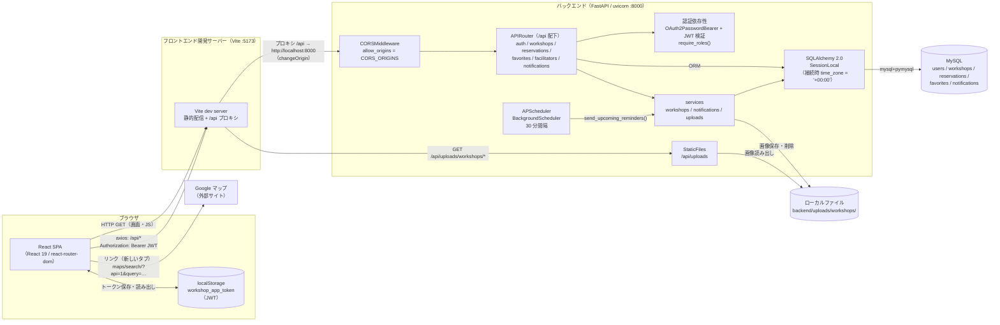

# システム構成図

最終更新日: 2026-09-25

ブラウザ上の React SPA（Vite 開発サーバー）から、Vite のプロキシ経由で FastAPI バックエンドの REST API を呼び出し、MySQL にデータを保存する構成。画像はバックエンドのローカルディレクトリに保存し、リマインド通知は FastAPI プロセス内の APScheduler が定期実行する。本書はコードから読み取れる開発環境の構成のみを示し、本番環境のホスティング先等は扱わない。

## 構成図

### 通信・認証の流れ

1. ログイン: SPA が `POST /api/auth/login` に `application/x-www-form-urlencoded`（`username` = メールアドレス, `password`）を送信し、`{ access_token, token_type: "bearer" }` を受け取る（`frontend/src/api/auth.ts:21-29`、`backend/app/routers/auth.py:37-47`）。
2. トークン保存: `localStorage` の `workshop_app_token` に保存（`frontend/src/api/client.ts:3`、`frontend/src/context/AuthContext.tsx:45-51`）。
3. API 呼び出し: axios のリクエストインターセプターが全リクエストに `Authorization: Bearer <token>` を付与（`frontend/src/api/client.ts:9-15`）。
4. 検証: バックエンドは `OAuth2PasswordBearer` でトークンを取り出し、`python-jose` で HS256（既定）署名と有効期限を検証、`sub`（ユーザー ID）からユーザーを取得（`backend/app/core/deps.py`、`backend/app/core/security.py`）。
5. 401 応答時: axios のレスポンスインターセプターがトークンを削除（`frontend/src/api/client.ts:17-25`）。
6. 起動時: トークンがあれば `GET /api/auth/me` でユーザー情報を復元し、失敗すればトークンを削除（`frontend/src/context/AuthContext.tsx:23-39`）。

- JWT の有効期限は `JWT_EXPIRE_MINUTES`（既定 1440 分 = 24 時間）。リフレッシュトークンの仕組みはない。
- 認可は `require_roles(UserRole.admin, UserRole.facilitator)` とハンドラ内の所有者チェック（`_get_owned_workshop`）で行う（`backend/app/core/deps.py:43-52`、`backend/app/routers/workshops.py:24-30`）。
- 日時は API の応答では UTC のタイムゾーン付き（`Z` 付き）で返し、入力はタイムゾーンなしの UTC に変換してから DB に保存する（`backend/app/schemas/types.py`）。DB 接続では `init_command` で `SET time_zone = '+00:00'` を実行し、セッションのタイムゾーンを UTC に固定している（`backend/app/database.py:8-13`）。フロントエンドは `toISOString()`（UTC）で送信し、受信した日時を `toLocaleString('ja-JP')` でブラウザのローカル時刻で表示する（`frontend/src/pages/manage/WorkshopFormPage.tsx:151-152`、`frontend/src/utils/format.ts`）。
- 未読通知件数は、ログイン中は 60 秒ごとに `GET /api/notifications/unread-count` をポーリングして取得する（`frontend/src/context/NotificationContext.tsx:14, 32-37`）。

### 画像アップロード

- `POST /api/workshops/{id}/image`（`multipart/form-data`、フィールド名 `file`）で受信し、`backend/uploads/workshops/<uuid4>.<ext>` に保存、`workshops.image_url` に `/api/uploads/workshops/<ファイル名>` を記録する（`backend/app/services/uploads.py`、`backend/app/routers/workshops.py:145-161`）。
- 許可形式は jpeg / png / webp / gif、上限は `MAX_UPLOAD_SIZE_BYTES`（既定 5MB）。フロントエンドでも同じ条件を事前チェックする（`frontend/src/pages/manage/WorkshopFormPage.tsx:14-15`）。
- 保存先ディレクトリは `UPLOAD_DIR`（既定 `uploads`、相対パスなら `backend/` 基準）。起動時に作成され、`/api/uploads` として `StaticFiles` で公開される（`backend/app/config.py:35-38`、`backend/app/main.py:51-52`）。
- 画像差し替え・削除時は旧ファイルを削除する。

### スケジューラ（リマインド通知）

- FastAPI の `lifespan` で `BackgroundScheduler` を起動し、30 分間隔で `send_upcoming_reminders()` を実行する（`backend/app/main.py:13-30`）。
- 公開中かつ開始日時が「現在 + 23 時間 〜 現在 + 25 時間」のワークショップについて、予約確定済みのユーザーへ `reminder` 通知を作成する。一意制約により同一通知は 1 回のみ（`backend/app/services/notifications.py:14-15, 42-60`）。
- スケジューラは API サーバーと同じプロセス内で動く。uvicorn を複数ワーカーで起動した場合はワーカーごとにジョブが動く（一意制約により通知の重複は発生しない）（※推測）。

### 外部サービス

- Google マップ: API キーを用いた埋め込みではなく、`https://www.google.com/maps/search/?api=1&query=<場所>` へのリンクを新しいタブで開くのみ（`frontend/src/utils/maps.ts`）。
- メール送信・決済などの外部サービス連携はない（参加費は「当日会場にてお支払い」と表示するのみ）。

### 開発時の起動構成

- リポジトリルートの `npm run dev` で `concurrently` によりバックエンド（`uvicorn app.main:app --reload --port 8000 --app-dir backend`）とフロントエンド（`vite`）を同時起動する（`package.json`）。
- `GET /api/health` はヘルスチェック用に `{"status": "ok"}` を返す（`backend/app/main.py:55-57`）。

## 技術スタック

バージョンは `frontend/package.json` の指定範囲（`^` / `~` 付き）と `backend/requirements.txt` の固定バージョンをそのまま記載する。

| レイヤー | 技術 | バージョン | 用途 |
|---|---|---|---|
| フロントエンド | React / React DOM | ^19.2.8 | UI |
| フロントエンド | react-router-dom | ^7.18.3 | ルーティング |
| フロントエンド | axios | ^1.20.0 | HTTP クライアント |
| フロントエンド | TypeScript | ~6.0.2 | 型 |
| フロントエンド | Vite | ^8.2.2 | 開発サーバー・ビルド |
| フロントエンド | @vitejs/plugin-react | ^6.1.0 | Vite React プラグイン |
| フロントエンド | Tailwind CSS / @tailwindcss/vite | ^4.3.3 | スタイル |
| フロントエンド | oxlint | ^1.79.0 | Lint |
| バックエンド | FastAPI | 0.121.2 | Web API |
| バックエンド | uvicorn[standard] | 0.38.0 | ASGI サーバー |
| バックエンド | SQLAlchemy | 2.0.44 | ORM |
| バックエンド | Alembic | 1.17.0 | マイグレーション |
| バックエンド | PyMySQL | 1.1.1 | MySQL ドライバ |
| バックエンド | cryptography | 50.0.1 | PyMySQL / python-jose の暗号処理 |
| バックエンド | pydantic[email] | 2.13.5 | スキーマ・バリデーション |
| バックエンド | pydantic-settings | 2.11.0 | 設定（環境変数 / `.env`） |
| バックエンド | python-jose[cryptography] | 3.5.0 | JWT |
| バックエンド | bcrypt | 5.0.0 | パスワードハッシュ |
| バックエンド | python-multipart | 0.0.20 | フォーム / ファイル受信 |
| バックエンド | python-dotenv | 1.1.1 | `.env` 読み込み |
| バックエンド | APScheduler | 3.11.0 | 定期ジョブ |
| DB | MySQL | 記載なし | データストア |
| 開発ツール | concurrently | ^9.0.1 | フロント・バック同時起動（ルート `package.json`） |

## 環境変数

`backend/app/config.py` の `Settings`（pydantic-settings、`.env` から読み込み）で定義されている。値は記載しない。

| 変数名 | 用途 | `.env.example` への記載 |
|---|---|---|
| `DB_HOST` | MySQL ホスト | あり |
| `DB_PORT` | MySQL ポート | あり |
| `DB_USER` | MySQL ユーザー | あり |
| `DB_PASSWORD` | MySQL パスワード | あり |
| `DB_NAME` | データベース名 | あり |
| `JWT_SECRET_KEY` | JWT 署名鍵 | あり |
| `JWT_ALGORITHM` | JWT 署名アルゴリズム | あり |
| `JWT_EXPIRE_MINUTES` | JWT 有効期限（分） | あり |
| `CORS_ORIGINS` | CORS 許可オリジン（カンマ区切り） | あり |
| `UPLOAD_DIR` | アップロード画像の保存ディレクトリ | あり |
| `MAX_UPLOAD_SIZE_BYTES` | アップロード画像の最大サイズ（バイト） | あり |

- フロントエンドには環境変数ファイルはなく、API のベース URL は `/api` 固定、プロキシ先は `vite.config.ts` に `http://localhost:8000` と直書きされている。

---

参照したファイル:
- `frontend/vite.config.ts`
- `frontend/package.json`
- `frontend/src/main.tsx`
- `frontend/src/api/client.ts`
- `frontend/src/api/auth.ts`
- `frontend/src/context/AuthContext.tsx`
- `frontend/src/context/NotificationContext.tsx`
- `frontend/src/utils/maps.ts`
- `frontend/src/pages/manage/WorkshopFormPage.tsx`
- `package.json`
- `backend/app/main.py`
- `backend/app/config.py`
- `backend/app/database.py`
- `backend/app/core/deps.py`
- `backend/app/core/security.py`
- `backend/app/services/uploads.py`
- `backend/app/services/notifications.py`
- `backend/app/schemas/types.py`
- `backend/app/routers/auth.py`
- `backend/app/routers/workshops.py`
- `backend/requirements.txt`
- `backend/.env.example`
- `backend/alembic/env.py`
